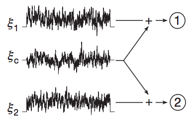
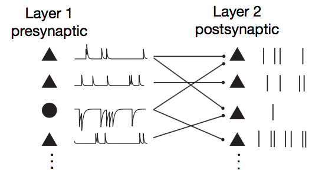
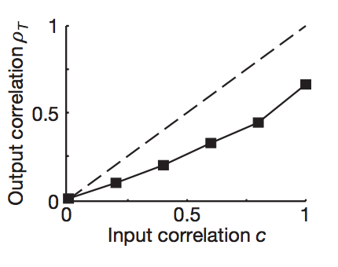
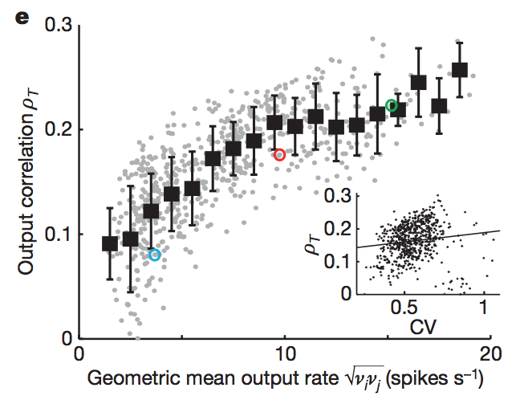
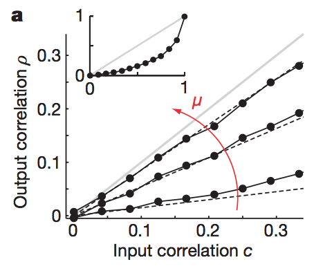
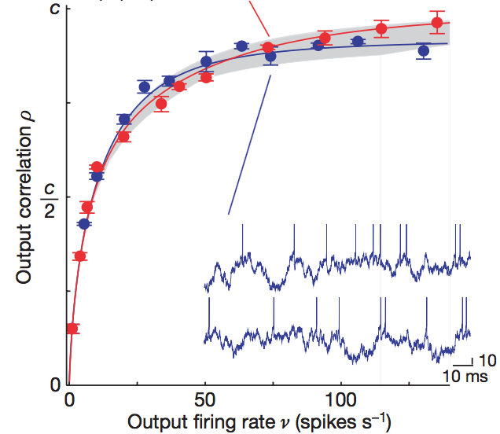
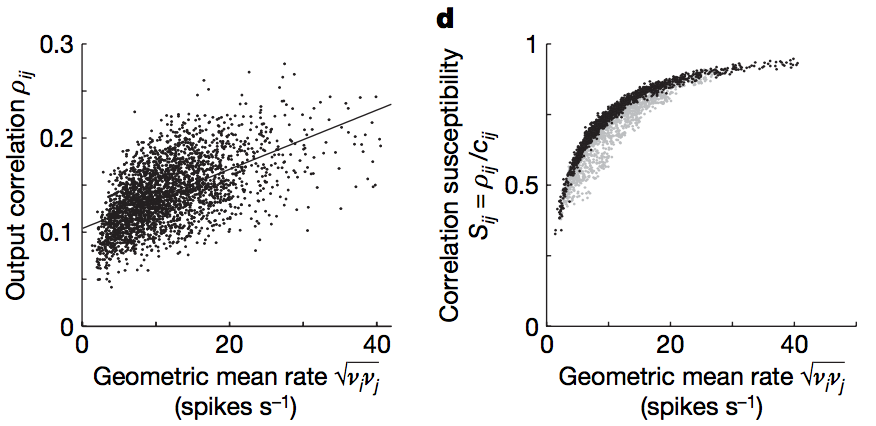
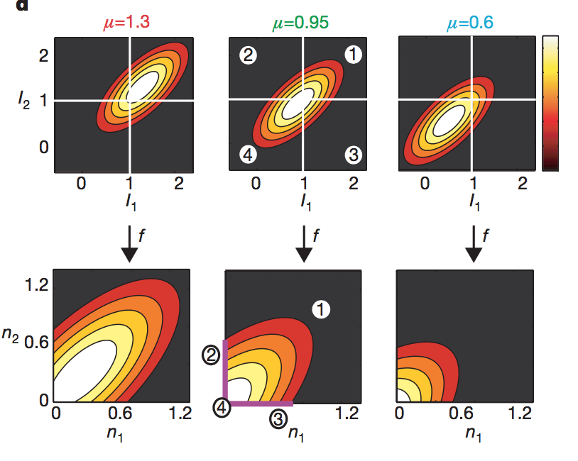

#Correlation between neural spike trains increases with firing rate

* **Authors**: Jaime de la Rocha, Brent Doiron, Eric Shea-Brown, Kresimir Josic, Alex Reyes
* **Journal**: Nature Letters
* **Date**: August 2007

##Big Idea
* A variety of experiments have shown that certain populations of neurons exhibit pairwise correlated variability in response to a stimulus. Theoretical models have lead to better understanding of correlated variability, but it is less well understood for spiking models. Specifically, what influences the strength of the correlation between two neurons? Is it just the correlations that they inherit, or does it also depends on their spiking (for example, the mean and variance of their spiking). This paper attempts to answer this question.

* The authors find that increasing the mean and variance of the spike trains increases the pairwise correlation between the neurons. The spike count correlation is upper bounded by the correlation inherited by the afferents.

* The reason for this is essentially the thresholding nonlinearity in spiking. The threshold caps off correlational structure exhibited by the input currents and makes the output distribution look more isotropic. If the mean firing rate or spread of the firing rate is increased, more of the distribution will escape the threshold and we will see a larger fraction of the inherited correlational structure. 

##Experimental Setup
They performed experiments as well as simulations.

1. In their first experiment, they considered 20 unconnected cortical neurons (in vitro) as pairs. Each pair had individual Gaussian noise injected ($\xi_i$) along with a shared Gaussian noise ($\xi_c$) (to model synaptic activity). The shared noise had a variance of $c$, which serves as the input correlation coefficient. The total input current to the cell $i$ was $$I_i = \mu_i + \sigma_i (\sqrt{1-c} \xi_i(t) + \sqrt{c} \xi_c(t)),$$ so the goal was to see how the correlation between the spike counts of the cells depended on $\mu_i$ and $\sigma_i$. 
 <b>Figure 1a</b>

2. They also performed simulations on leaky integrate and fire neurons. Choosing a $\mu$ and $\sigma$ for their neurons, they also calculated perturbatively (assuming weak correlations, $c < 0.3$) the correlation coefficient $\rho(c)$. Thus, they had both analytical results and simulated results to compare to each other. 

3. They also considered a more biologically plausible network. The network consisted of two layers of neurons. The network had sparse connectivity and homogeneity in the choices of the means, variances, and input correlations. Below, the network architecture is shown:

<b>Figure 3a</b>

##Results
1. In the first experiment, they find that the correlation $\rho_T$ (taken over time windows of length $T = 40$ ms) between the spike counts of the cells *increased* with the firing rates of the cells, $\nu_i$. The two main results are shown below:
 <b>Figure 1d</b>

<b>Figure 1e</b>
In the first plot, we see that the output spike count correlation increases as the input correlation increases. The more interesting result is the next plot: the output correlation $\rho_T$ increases as the geometric mean of the output rates (this is to account for either of the cells firing strongly). Thus, if the cells fire more, they are more correlated! Inset shows a similar plot, but plotted against the coefficient of variation - we see that there is not a strong relationship between the two. 

2. Their simulations/analytical calculations show similar results. They find that increasing both the mean $\mu$ and standard deviation $\sigma$ increases the output correlation $\rho$:

<b>Figure 2a</b>
Above shows the impact of increasing the mean, but increasing the standard deviation looks very similar. Note that while they increasing $\mu$ or $\sigma$, the other was held constant. Furthermore, they find that the output correlation increases as a function of the output firing rate $\nu$:

<b>Figure 2c</b>
The red dots show simulations from increasing $\sigma$ while holding $\mu$ constant, and red is vice versa. Solid lines are analytical results. Notice that the curves tend to saturate toward $c$.
3. Below are the results of their experiment with the two layer network. Roughly, the correlation increases with the output spike rate (specifically, the geometric mean). Furthermore, they considered a quantity called the correlation susceptibility, $S_{ij} = \rho_{ij}/c_{ij}$. This quantity tells us the ratio of the output correlation to the input correlation. We see that it smoothly approaches 1 as the firing rate increases.

<b>Figure 3c, 3d</b>

## Mechanistic Understanding
So, we see an obvious relationship between the input correlation and the firing rate of the output neurons. It seems that increasing the firing rate causes the neuron's correlated variability to asymptote to that of the input correlation.

<b>Figure 4d</b>

For example, the three pairs of diagrams above. These diagrams consider a two neuron system with various $\mu_i$ (the baseline input current). 

In the first pair, we have a large $\mu$ compared to the threshold for spiking. Thus, the output distribution (number of spikes of one neuron plotted against the other), while cut off, exhibits much of the correlational structure that is inherited by the input currents. In the second and third diagrams, however, the mean is lowered. Thus, the threshold comes into play, and we see less of the input distribution. 

The general principle is that nonlinearities in the firing of neurons reshape the input correlations. In the case of thresholding, if we had a large firing rate, we most likely had a larger input current. Thus, we will see more of the input distribution's character.