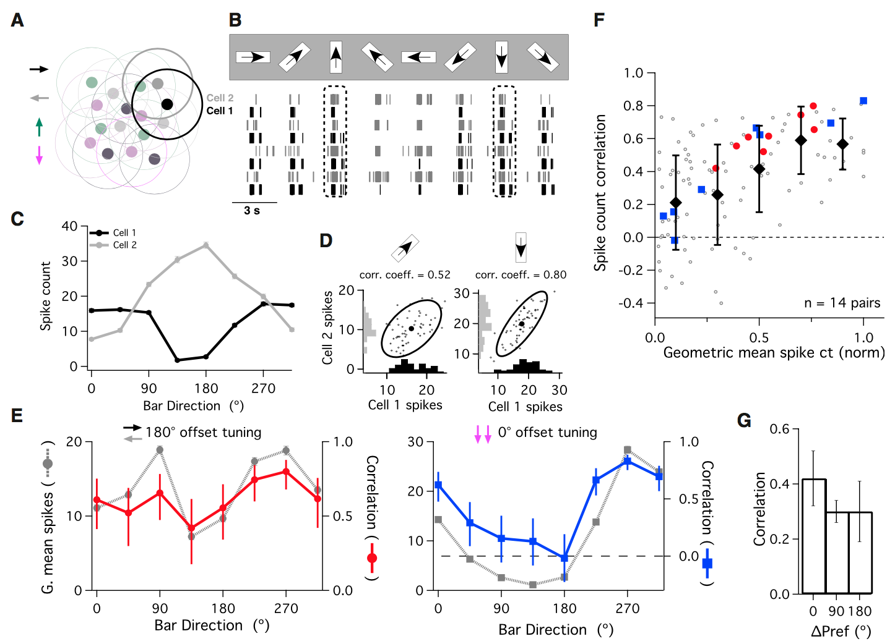
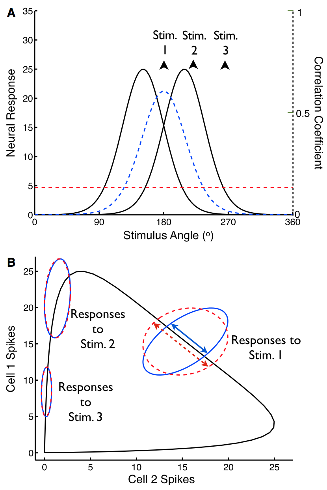
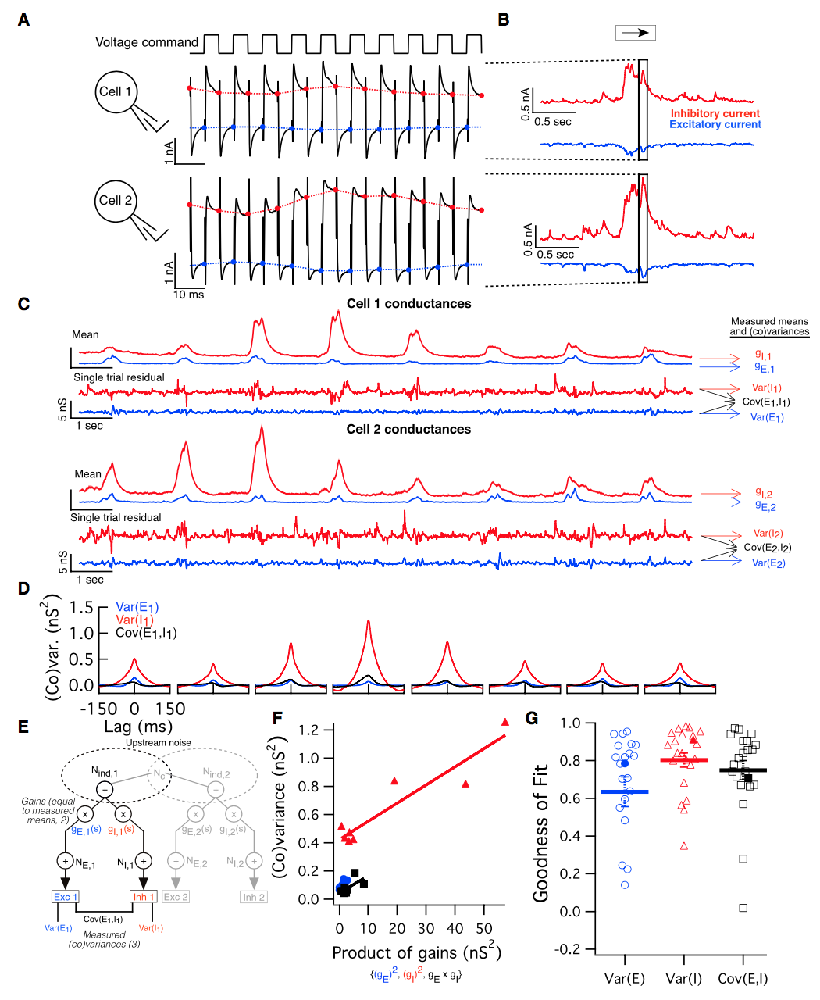
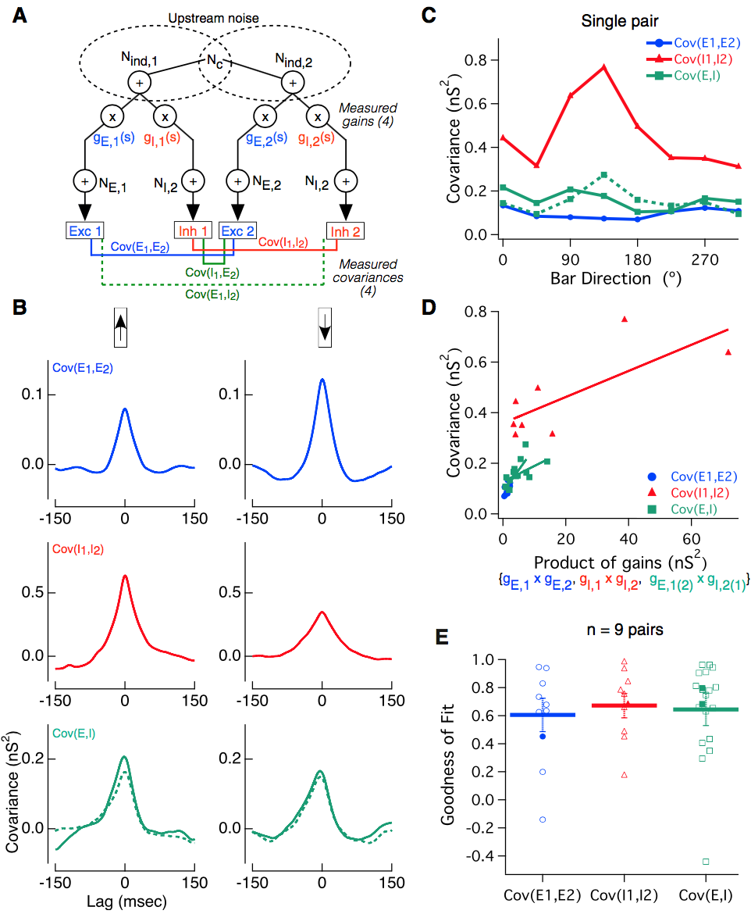
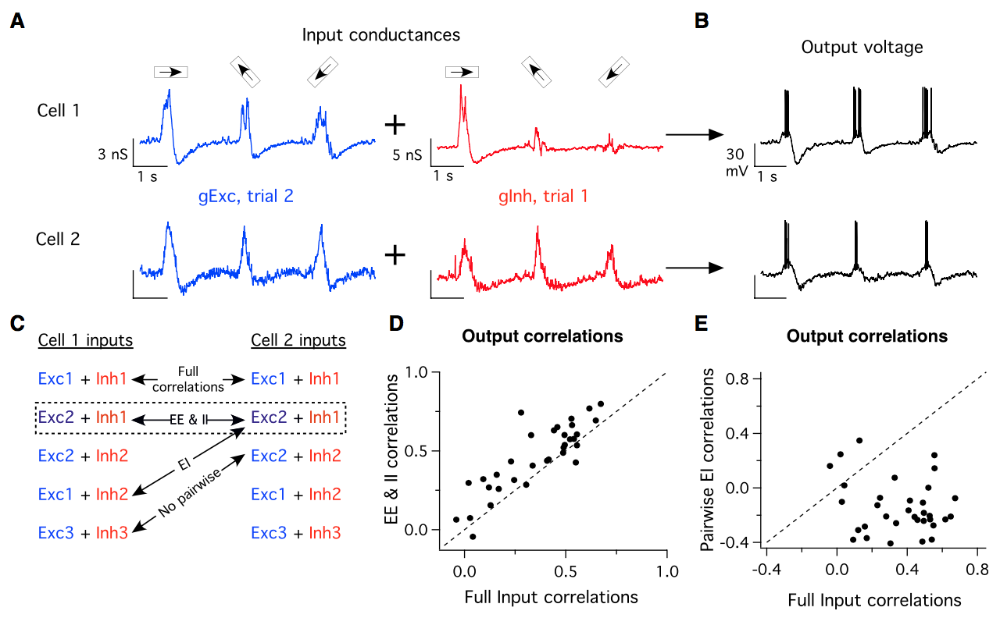
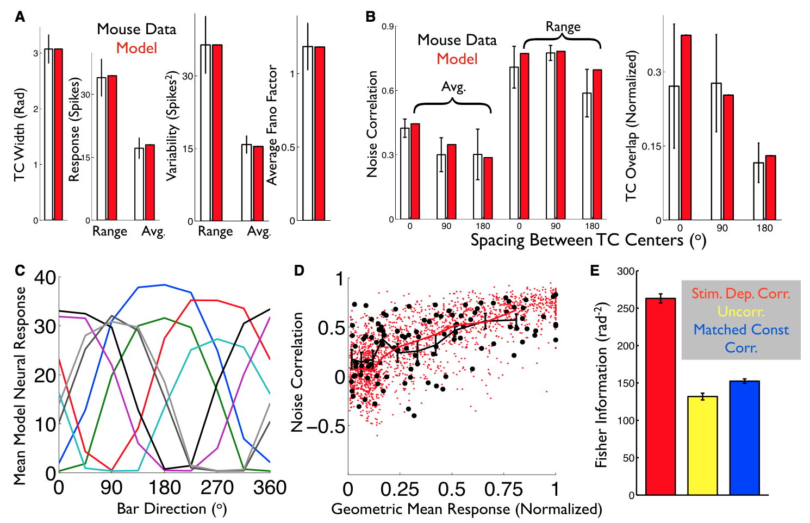
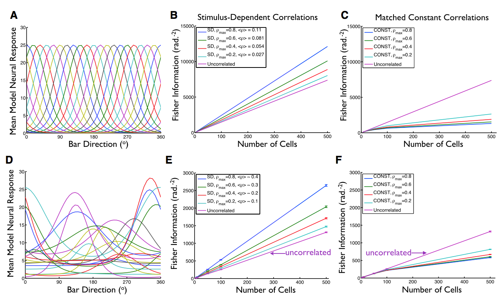
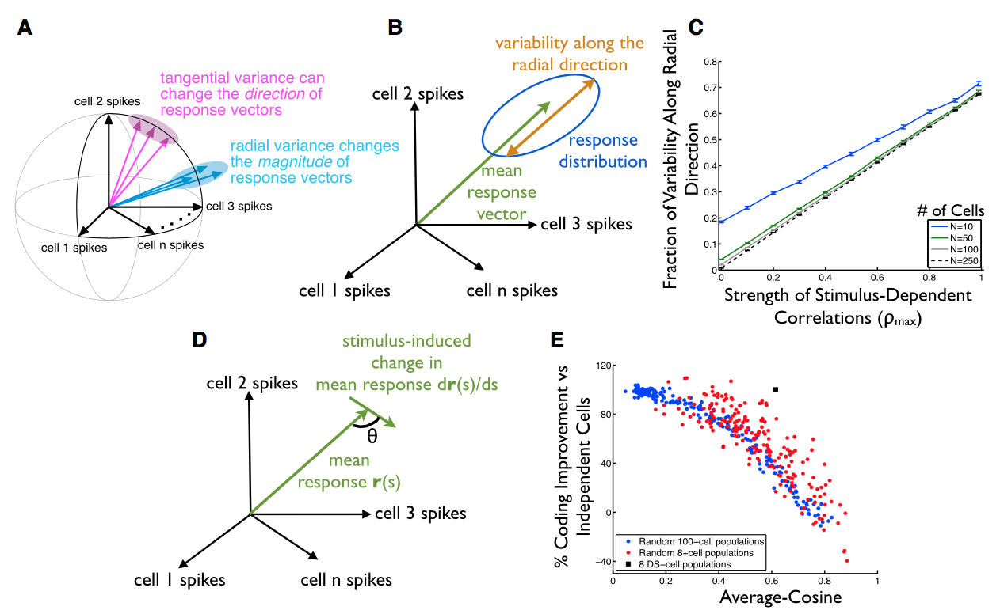

# Direction Selective Circuits Shape Noise to Ensure a Precise Population Code
* **Authors:** Joel Zylberberg, Jon Cafaro, Maxwell H. Turner, Eric Shea-Brown, Fred Rieke
* **Journal:** Neuron 
* **Date:** January 2016

## Big Idea
* When thinking about noise correlations, we need to be aware of the correlations' stimulus-dependence. Previous studies have typically averaged the correlations over stimuli, but this hides important structure. If the correlations have stimulus-dependence, they can reshape the response variability in such a way that is beneficial for coding depending on where we are located on the signal curve.
* This study presents both experimental and theoretical results supporting this idea. They examine direction-selective retinal ganglion cells and show experimentally that pairs of these cells exhibit stimulus-dependent correlations. They show that the stimulus-dependent correlations can be explained by (stimulus dependent) gain modulation in shared noise between excitatory and inhibitory inputs to the retinal ganglion cells. 
* Thus, noise correlations must be understood within the scope of the entire population structure. The geometry of the signal space decides whether noise correlations are beneficial or harmful. The specific structure of the noise correlations can be obtained simply by changing the neural circuitry dynamics. 

## Background
* Biophysical processes are noisy, and this noise can be shared across downstream neurons, causing their responses to covary. Previous results have shown that these noise correlations can influence the coding ability of a population of neurons. Specifically, most studies have not considered the impact of *stimulus-dependence* of the noise correlations. Instead, they assume the noise correlations are constant across choice of stimulus and even firing rate. 
* This paper attempts to investigate, with theoretical and experimental analyses, the neural circuitry that can invoke stimulus-dependent noise correlations and furthermore their influence on a population code. 
* To do so, they examine ON-OFF directionally selective ganglion cells (ooDS cells), which are sensitive to the directions of moving objects.

## Correlated Variability in the Spiking Responses of ooDS Cell Pairs
*What is correlated variability, and what is its character in direction selective retinal ganglion cells?*

* In their experimental work, the authors examined the ooDS cells in mice, which are selective to the 4 cardinal directions. Furthermore, their receptive fields are overlapping (see **Figure 1A**, below). 
* They presented stimuli moving in 8 different directions and recorded the resulting spike counts in each of the cells (shown in **Figure 1B**, below). For the rest of the plots in the figure, they use two specific cells, 1 and 2, which are selective to left and right motion, respectively.
 <b>Figure 1</b>

* They find that the tuning curves behave as you might expect for the cells: cell 1 fires the most when the bar moves to the right (0 degrees) and cells 2 fires the most when the bar moves to the left (180 degrees). Over repeated trials, shown in **Figure 1D**, the correlation coefficient is stronger when both cells are firing more strongly (compare up-right to down, the latter of which has a larger correlation coefficient). 
* Over all stimuli and cells, they see that the correlation between a pair of ooDS cells behaves similarly as the geometric mean of their spike counts (this makes sense, based on de la Rocha et al.).
* **Figure 1E** just shows how the geometric mean of spike counts for a pair of oppositely tuned/similarly tuned cells behave. In general, cells tuned more differently have smaller correlation coefficients (as we might expect, see **Figure 1G**). 

## Why Might Stimulus Dependence of Noise Correlations Affect Population Codes?
*Okay, we see stimulus-dependent correlated variability. Why does it improve population coding?*

* The authors note that while stimulus-dependence of noise correlations has been observed before, many studies the noise correlations over stimuli resulting in stimulus-independent noise correlations. The authors offer intuition on why stimulus-dependent noise correlations can be beneficial to coding. 
* First, consider model tuning curves for ooDS cells (Gaussians, shown below), the observed stimulus-dependent noise correlations (proportional to the geometric mean of their firing rates, shown in blue), and the stimulus-independent noise correlations (averaged over possible stimuli, shown in red).
 <b>Figure 2</b>

* We can look at the "signal space" of the two-neuron system. This consists of the average firing rates of the two neurons plotted against each other, shown as the black curve above (in **Figure 1B**). The trial-to-trial variability (possible responses in the signal space) is indicated by the covariance ellipses in blue (stimulus-dependent) and red (stimulus-independent). We see that in the regions where both cells are spiking (the geometric mean is the highest) the stimulus-dependent correlated variability is tighter and more perpendicular to the signal curve. This is good for decoding - the worst thing to happen is if our trial-to-trial variability places us in a region of signal space that might make us misconstrue the stimulus. 

## Mechanisms Underlying Stimulus-Dependent Correlations
*Great, so there's stimulus-dependent correlations and the brain is able to use them for higher fidelity coding. How exactly, biophysically, do we get stimulus dependence in the correlated variability?*

### Correlations within excitatory and inhibitory inputs of a specific cell
* There's two immediate possible sources of correlated variability: common synaptic input (which can produce shared noise) and recurrent coupling (also induces shared noise through feedback). They argue that common synaptic input is the only thing we need to be concerned with, since there's a lack of known coupling between specific ooDS cells and a feedforward model can explain their observed correlations. 
* They looked at a pair of ooDS cells and their excitatory and inhibitory synaptic inputs. They used an alternating voltage technique to perform their measurements to obtain near simultaneous recordings (this technique was used by Cafaro, Rieke in a previous study). 
 <b>Figure 3</b>

* After looking at the excitatory and inhibitory inputs, shown in **Figure 1C** above (for two specific cells), they subtracted the mean from each trial to obtain a residual, and treated this as the variability. Using that, they were able to find variances and covariances of and between the excitatory and inhibitory input. 
* They find that the inhibitory input typically shows a much higher variances than the excitatory input. Furthermore, the covariance between the two is small but slightly nonzero at stimulus onset. 
* To model this, they have common upstream noise $N_c$ as a contribution to the total individual noise $N_{\text{ind}}$ coming into a neuron. This noise is passed through an excitatory and inhibitory gain (the conductances) and has additional excitatory and inhibitory noise $N_{E,1}$ and $N_{I,1}$ added on top of it. This implies that the covariance between excitatory and inhibitory input will be directly proportional to the product of their gains, which is shown in **F**.

### Correlations between cell pairs 
* Above, they just looked at the excitatory and inhibitory input within one cell. Here, they look at the covariances between two cells in a pair. There's 4 combinations they can look at: EE, EI, IE, or II. (shown in **Figure 4A**).
 <b>Figure 4</b>

* Important points, looking at their results: the covariances show some stimulus dependence on the bar direction (these points were taken at the peak point of stimulus onset). Note that **Figure 4C** shows results for a specific pair of cells which are tuned for upward movement and downward movement (90 and 270 degrees)
* They hypothesize that the covariance of two inputs will be directly proportional to the product of their corresponding conductances, which is supported by **Figure 4D**, above. Plot **Figure 4E** shows the correlations between the covariance of two inputs and the product of gains among all cell pairs. On the whole, most cell pairs exhibited a positive correlation, indicating product of gains increases with covariance of input. But there were a couple outliers. 

### Relating Input and Output Correlations 
* Next, they did dynamic clamping experiments (where they take the conductances they measured and use it to run synaptic current through cells, to simulate their spiking behavior) to see how the input correlations in the conductances affected the output correlations in the spiking. They used both simultaneous measurements, but also shuffled the data to have non-simultaneous recordings. 
 <b>Figure 5</b>

* **Figure 5A** through **5C** show the different combinations they considered in the dynamic clamping experiment. By picking and choosing different conductances, they could simply have full correlations (both cells receive the same excitatory/inhibitory inputs), EE/II correlations (excitatory of cell 2, inhibitory of cell 1), EI correlations (mixing both excitatory/inhibitory inputs) and no pairwise correlations (completely shuffled trials).
* They show the output correlations in spiking compared to the full input correlations. They find that EE/II correlations increase the noise correlation, while pairwise EI correlations have slightly negative or zero noise correlations. Thus, EE/II correlations increase, whereas EI correlations reduce, correlations in spiking responses. 

## Impact of Stimulus-Dependent Correlations on Direction Coding
### Correlations, Stimulus Dependence, and Coding Performance
* They came up with a model (with 13 free parameters) for their ooDS cells. The model generally follows that of **Figure 4A**, shown two figures above. Specifically, they had to model the conductances for excitatory and inhibitory input which had some sinusoidal dependence on the angle of the bar. They used a roughly constant conductance for excitatory input (because they found it varies much less than the inhibitory input). For spiking, they passed excitatory and inhibitory input through a threshold-linear function.
* 13 free parameters: excitatory conductance $g_e$, base inhibitory conductance $g_{i,\text{base}}$, max inhibitory conductance $g_{i,\text{max}}$, sharpness $\alpha_{\text{mean}}$, individual noise variances, correlation matrix of noise $\beta$, base currents for excitatory and inhibitory inputs, threshold, and slope of threshold. 
* Fitting these parameters to the data results in a model that agrees very well with the mouse data. The data is shown below, compared to the model predictions. They also show the performance of the model, quantified by Fisher information, in **Figure 6E**. They compare the stimulus-dependent correlations to the matched constant correlation (when the noise correlations were set equal to the average noise correlation, effectively removing stimulus dependence) as well as simple uncorrelated responses. The stimulus depdendent correlations perform far better. 
 <b>Figure 6</b>

### Larger, More Heterogeneous Neural Populations
* They considered the case of coding ability for a heterogeneous neural population, using the machinery developed by Josic et al. Their results for the performance of the Fisher information against population size is shown below, for both a homogeneous population and a heterogeneous population. 
 <b>Figure 7</b>

* They show two plots for each population: Fisher information for stimulus-dependent correlations, and for matched (set to average) constant correlations. In general, stimulus-dependent correlations perform much better than the matched correlations. Furthermore, increasing correlations in the matched case decreases coding performance while it increases coding performance in the stimulus-dependent case. 
* We can also see that the Fisher information is much larger in the homogeneous case vs the heterogeneous case, though it is unclear whether this is due to model parameters or is indicative of coding strength. 

### Geometric Intuition
* For tuning curves that tile the response space, the average responses (tuning curves) will tend to lie on a spherical surface in $N$-dimensional space. Thus, the best kind of noise correlations are those that lie perpendicular to this surface - in the radial direction. This variability will allow us to easily project down to the signal space (**Figure 8B**). 
* They calculated the fraction of the variability along the radial direction for the heterogeneously tuned neurons. They find that as the population size increases, weak correlations result in less of the variability lying along the radial direction. Thus, **Figure 8C** shows that larger correlations results in better coding. 
<b>Figure 8</b>

* They came up with an average-cosine metric to determine the coding strength of a network. They found the cosine of the angle between the mean response and its rate of change, averaged over all stimuli. If the stimulus-induced chage is perpendicular to the signal curve, then coding strength is better because the change takes us elsewhere on the signal curve. Thus, average-cosine should be close to 0 (for $\theta = 90^{\circ}$). 
* By choosing a variety of populations of neurons, they show that average-cosine is a good indicator of coding strength in **Figure 8E**, because as average-cosine increases, coding improvement tends to decrease. 