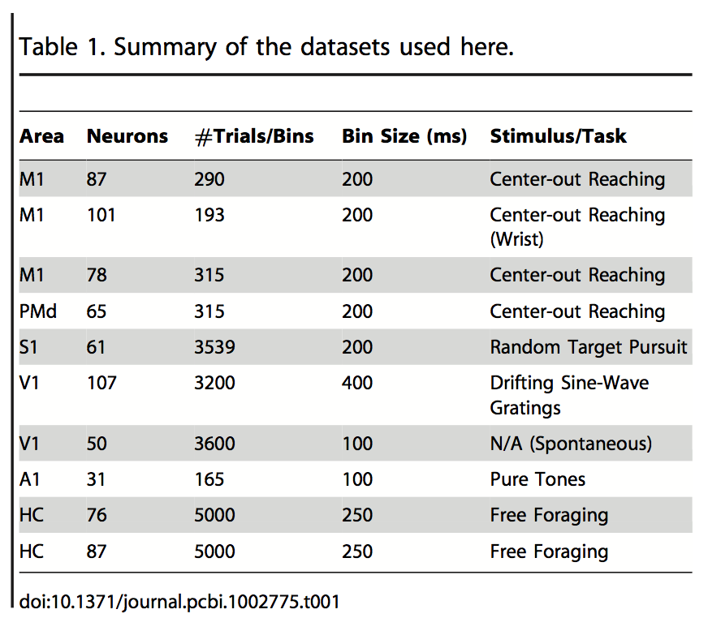
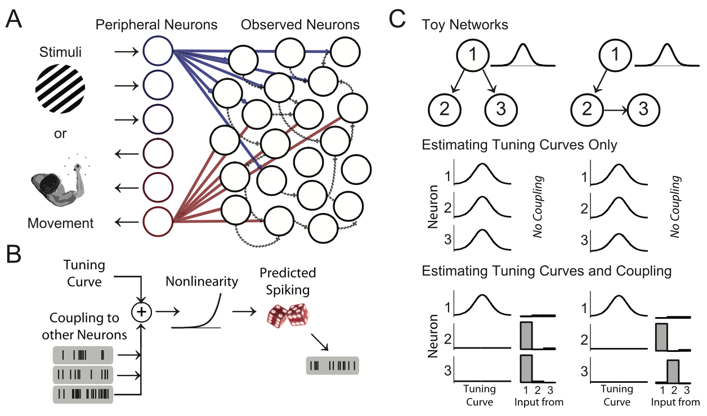
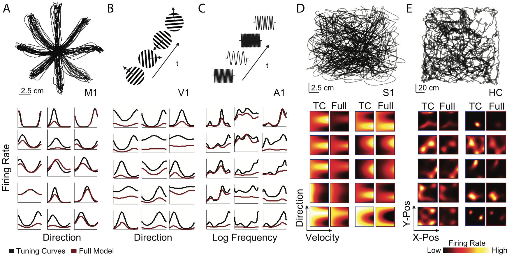
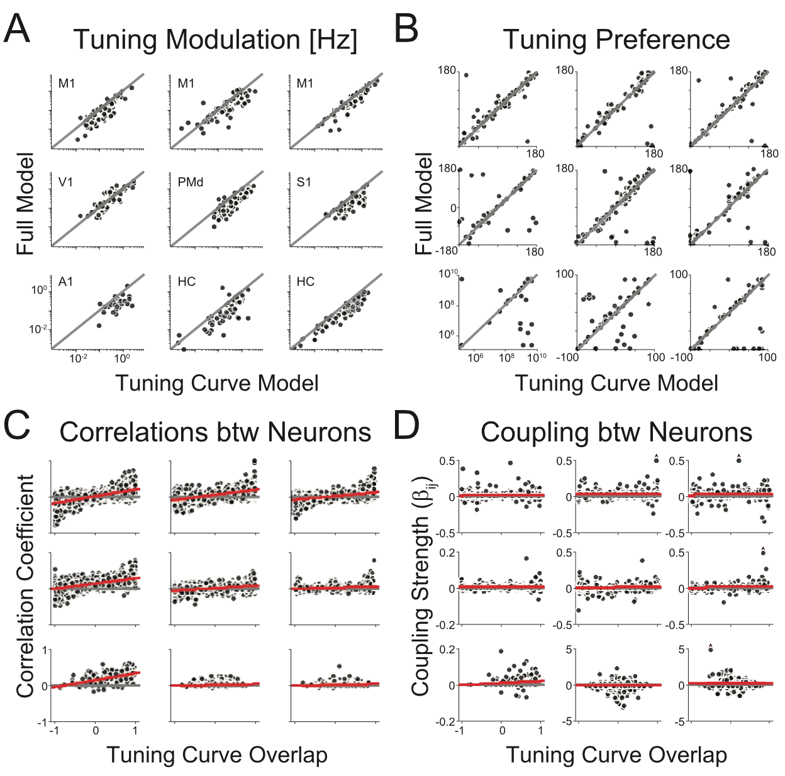
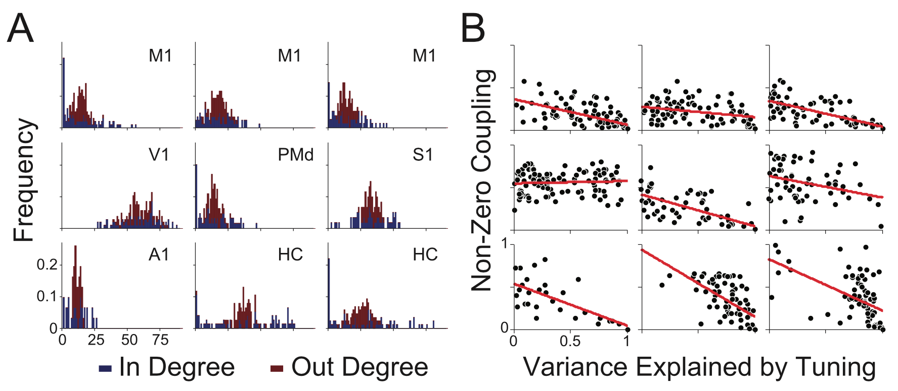
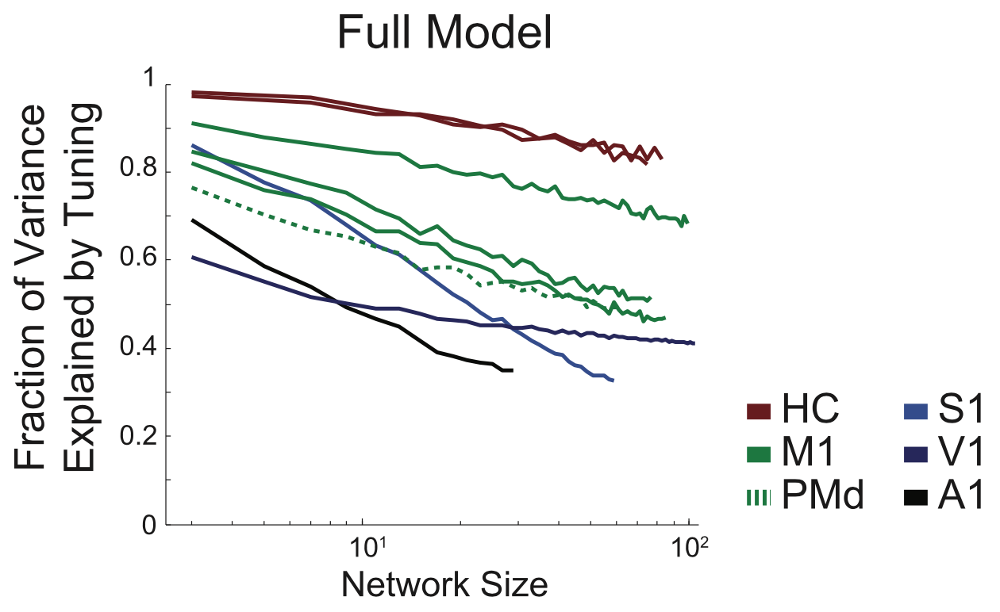
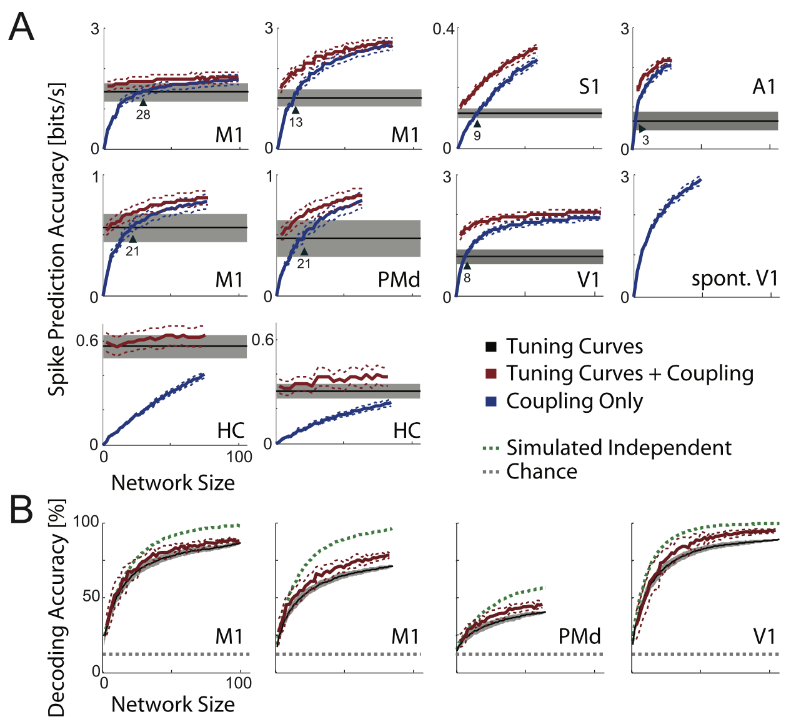
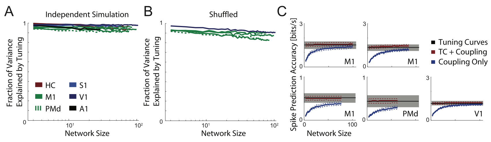
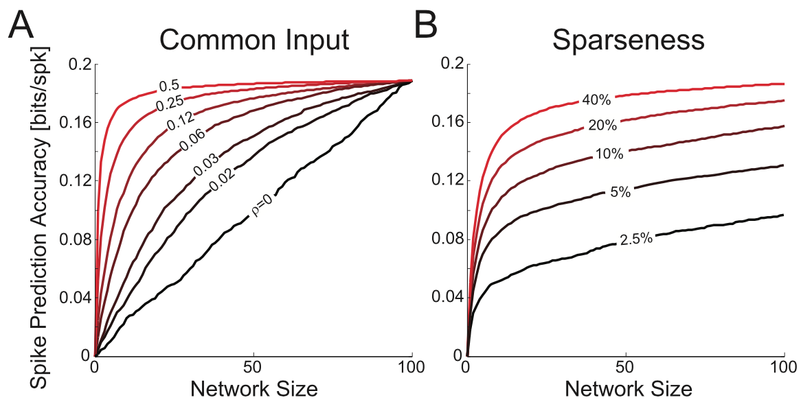

# Functional Connectivity and Tuning Curves in Populations of Simultaneously Recorded Neurons

* **Authors:** Ian H. Stevenson, Brian M. London, Emily R. Oby, Nicholas A. Sachs, Jacob Reimer, Bernhard Englitz, Stephen V. David, Shibab A. Shamma, Timothy J. Blanche, Kenji Mizuseki, Amin Zandvakili, Nicholas G. Hatsopoulos, Lee E. Miller, Konrad P. Kording
* **Journal:** PLOS Computational Biology 
* **Date:** November 2012

## Introduction 
* In recent years, experiments have begun to simultaneously record large populations of neurons. Statistical analyses of the resulting data must begin to reflect the interconnectivity of these networks rather than simply assessing their dependence on external parameters (for example, tuning). 
* Thus, there's been a new wave a data-driven approaches which model a population's dependence on both external variables and interactions within the population. Here, they analyze recordings from six different brains areas with the goal of answering the following questions:
    1. How are estimated interactions between neurons related to apparent tuning properties?
    2. How do traditional tuning curve models change as interactions between neurons are included in the model? 
    3. How does our ability to predict and decode neural activity improve as increasing numbers of simultaneously recorded neurons are observed?

## Experiments
* Their datasets are summarized in the table below. In total, there are 10 multi-electrode spike datasets. Importantly, each dataset encompassed at least 30 neurons. 
 <b>Table 1</b>

* The recordings were as follows:
    * Primary (M1) and dorsal pre-motor cortex in (PMd) in a macaque monkey while it performs a reaching task. 
    * Primary somatosensory cortex (S1) in a macaque monkey while it performed a random target pursuit task. In this task, the monkey moves a robotic arm in an arena to obtain objects that appear sequentially.
    * Primary auditory cortex (A1) in a ferret that was exposed to random frequency tone stimuli.
    * Primary visual cortex (V1) in a paralyzed cat for evoked activity (randomly oriented moving gratings) and spontaneous activity. 
    * Dorsal hippocampus (HC) in a Long-Evans rat while freely foraging for food on a square platform. 

## Models

## Results
* In **Figure 1A**, we see a model of the neural population. The recorded neurons, presumably, both receive input and send output to peripheral neurons in some fashion.  Their experiments both ends of the information stream, as they recorded from neurons closer to the input periphery (V1, A1, etc.) and neurons closer to the output periphery (M1, PMd). One thing this figure tells us is that while the recorded neurons will obviously be influenced by tuning at the periphery, they'll also be influenced by *each other*, and our model should account for that.
 <b>Figure 1</b>

* **Figure 1B** depicts their model. They consider both external tuning and coupling to other neurons in a linear combination. Then, they apply an exponential nonlinearity and pass this time-dependent firing rate to a Poisson distribution, which produces spiking. 
* In **Figure 1C**, they provide a toy model of why interactions between neurons are important: tuning curves can be explained away. There's two different models: neuron 1 influences both neurons 2 and 3, and neuron 1 influences neuron 2 which influences neuron 3. If we *just* look at tuning, neurons 2 and 3 will have similar tuning to 1 and we might conclude that all three have the same tuning. But if we *condition* on neuron 1, we find that we can explain away the tuning dependence of neurons 2 and 3 by determining that they actually are just strongly coupled to neuron 1. Thus, the coupling between the neurons tosses out the explanation that they are tuned to external parameters. 

### Fitting the data
* Next, they fit the parameters using maximum a posteriori (MAP). Specifically, they chose the parameters that maximized their posterior distribution conditioned on the neural responses. In **Figure 2**, they show examples from the datasets they considered. Furthermore, they show the model's dependence on the external variables and compare it to a model that only considered external tuning. Takeaways: many of the tuning preferences remain the same, but the firing rate depends less strongly overall on the external parameters. This implies that connectivity with other neurons is an important contribution to the firing rate. 
 <b>Figure 2</b>

### Quantifying changes in tuning and correlations
* To quantify how the tuning changed, they show the *tuning modulation*, which is the difference between the highest firing rate and lowest firing rate of a given neuron's tuning curve. In **Figure 3A** below, they show the tuning modulation neurons in each of the brain regions. They plot the full model's tuning modulation against the tuning curve model's modulation. The grey line indicates that there's no change in tuning modulation between the two models. Overall, we see neurons clustering below the identity line, indicating a decrease in tuning modulation (note the log scale axes).  
 <b>Figure 3</b>

* However, note that tuning preference, shown in **Figure 3B**, does not change for many of the neurons (a large fraction of the points lie on the identity line). However, this is not ubiquitous. Thus, **Figures 3A and 3B** reinforce our observations of the tuning curves in **Figure 2**. 
* Next, they compared the spike count correlation coefficients between pairs of neurons to the amount of overlap between those neuron's tuning curves. The overlap is measured by cosine similarity: they take the tuning curve, write it as a vector, and calculate the cosine of the angle between the two vectors. They find that, for most datasets except for hippocampus, there is a positive relationship between the spike count correlation and the tuning curve overlap (albeit it's pretty weak). 
* They perform a similar comparison between the coupling strength $\beta_{ij}$ between two neurons and their tuning curve overlap. In this case, they very obviously find that there is no relationship between the two. Thus, what these plots are saying is that neurons that are tuned similarly are not going to necessarily be coupled strongly, but may exhibit similar spiking patterns. Thus, we can't fully "explain away" the tuning curves via coupling. 

### Out-degree vs. In-degree
* They looked out the out-degree and in-degree of neurons - effectively, how many connections each neuron sent out vs. how many connections each neuron obtained. I assume they did this by counting non-zero $\beta_{ij}$ parameters (or imposing a threshold). They find that the out-degree is more narrowly tuned on average (see **Figure 4A**, red, below) than the in-degree (blue). Furthermore, both distributions tend to be uni-modal (in contrast to power law, which is predicted by some models).  
 <b>Figure 4</b>

* Next, they plot the fraction of non-zero inputs (in other words, the normalized in-degree) against the variance explained by tuning. They find, in most cases, a negative relationship between the two quantities, which implies that neurons that receive more inputs have their tuning better explained by coupling. 

### The Number of Simultaneously Recorded Neurons
* Next, they considered what happens when they add neurons to their model. In **Figure 5** below, they plot the fraction of variance explained by tuning against the number of neurons. The results are what we expect: as we add more neurons, we see that more of the variance is explained by couplings rather than tuning. This true for all datasets, but less so for hippocampus.  
 <b>Figure 5</b>

### Encoding and Decoding Accuracy
* To extend the work from the previous figure, the authors examined both the ability of their model to encode spikes and also its ability to decode a spike output into the stimulus. Their spike encoding results are shown in **Figure 6A** below, where they show how the spike prediction accuracy behaves as a function of the number of neurons for each population of neurons. The tuning curves model is shown in black (it does not increase with the number of neurons, because I believe each neuron is predicting independently). The model incorporating coupling only is shown in blue, and as the number of neurons increases, it eventually outperforms the tuning alone model (except in the case of hippocampus). Lastly, the full model is shown in red. It eventually saturates in its prediction accuracy. 
 <b>Figure 6</b>

* Then, they used Bayesian decoding on a subset of data to decode the spikes into the stimulus. Their results are shown in **Figure 6B**. They find that the full model outperforms the tuning model, but does not perform as well as a model that decodes assuming the neurons are conditionally independent. Thus, it seems the correlational structure between the neurons is degrading the decoding performance. This has been well studied in the noise correlational literature. 

### Controls for Overfitting and Removing Noise Correlations
* Since the decoding strength is degraded, this leads us to ask whether their model is overfitting to the data (despite their efforts to regularize). To account for this, they fit a model where they had tuning curves that were conditionally independent given the stimulus. If this model does not perform well, but their full model did, that means they overfit. They find, however, that their simulated, independent neuron model performs very well (shown in **Figure 7A** below). Thus, they do not have to worry about overfitting. 
 <b>Figure 7</b>

* Next, to test the effects of noise correlations, they shuffled their data. This involved shuffling the spike counts within each trial condition, independently for each neuron. They find that shuffling the data does not affect the fraction of variance explained, implying that coupling is in fact explaining the neuron's behavior. 
* Lastly, they examined the spike prediction accuracy for the simulated network for varying degrees of input correlation (**Figure 8A**). When the inputs are uncorrelated (black), the spike prediction accuracy continues to increase with the addition of neurons. When the input is correlated, the prediction accuracy increases very quickly at first and then slowly increases. 
 <b>Figure 8</b>

* Then, they perform the same simulations but with varying degrees of sparsity (**Figure 8B**). For larger degrees of sparsity (red), the spike prediction accuracy increases.

## Discussion

### The unreasonable effectiveness of small numbers of neurons
* Neurons receive input from many thousands of other neurons. Yet, the results in this study, which only consider up to ~100 neurons, are able to explain much of the spiking variance by modeling their interactions. One reason for this is that neurons are correlated in their trial-to-trial variability. However, the coupling terms do not explain away the tuning curves when the data is shuffled, implying that their results do not stem strictly from stimulus correlations. 
* At any rate, there is merit in modeling unobserved common input that may provide a source of the correlated variability. 

### Towards a description of tuning properties based on network architecture
* While the data-driven approach described in this study is able to describe the behavior of neurons quite well, it sheds little light on the network architecture underlying the neural circuitry. Thus, future work should focus on bridging the gap in sensory and motor cortices, similarly to what has been done in retina. 