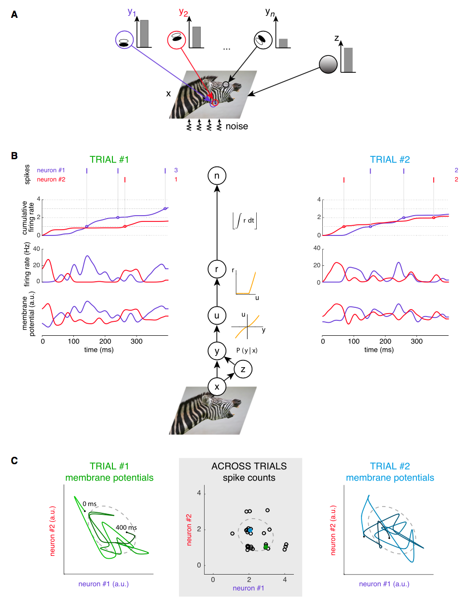
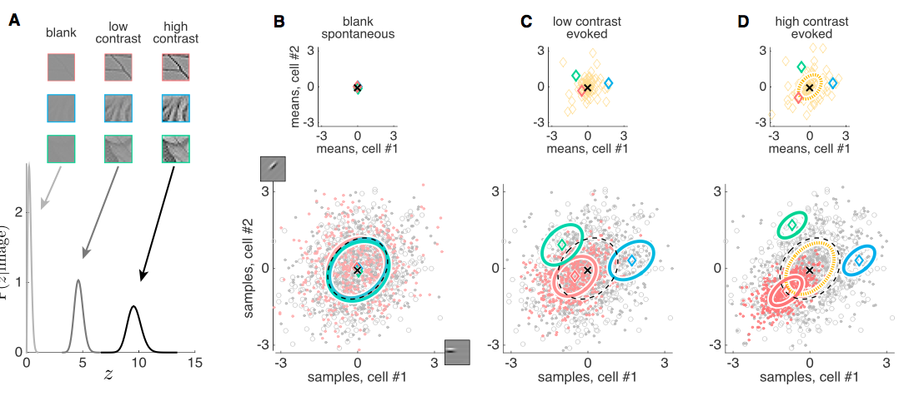
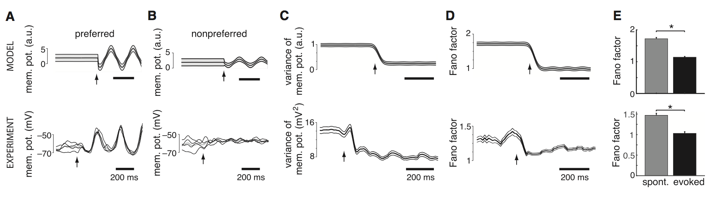
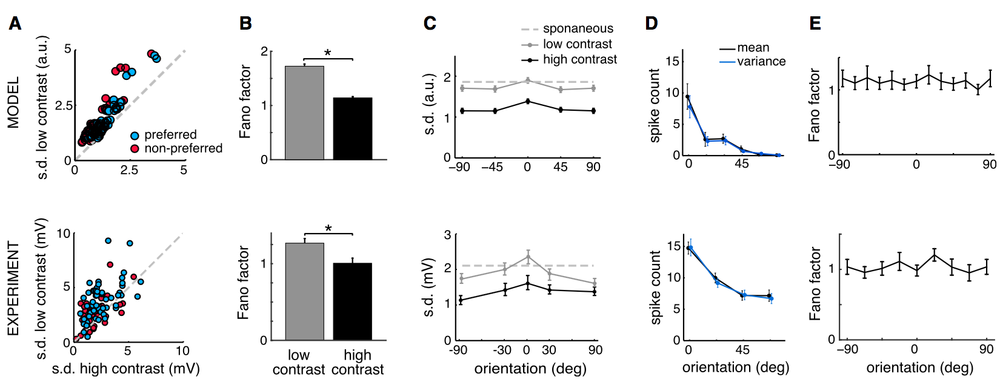
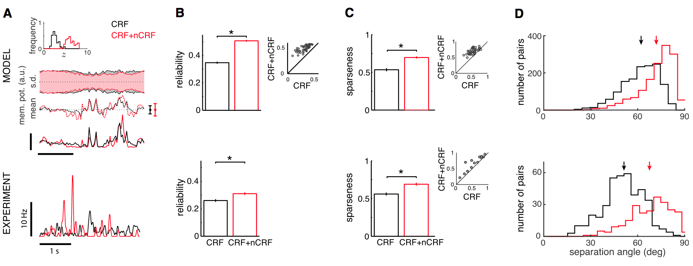
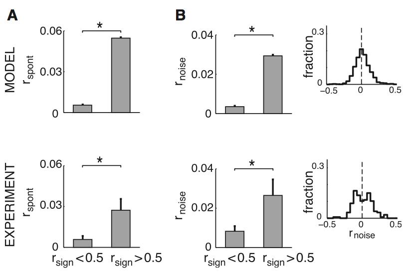
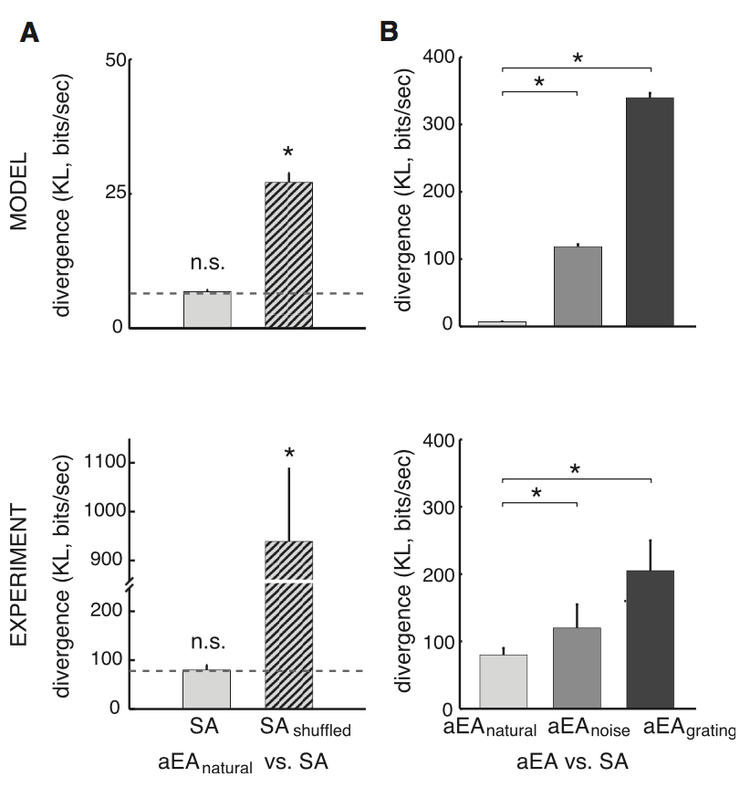

# Neural Variability and Sampling-Based Probabilistic Representations in the Visual Cortex

* **Authors:** Gergó Orbán, Pietro Berkes, József Fiser, Máté Lengyel
* **Journal:** Neuron
* **Date:** October 2016

## The Big Picture
The authors support the idea that the brain samples a posterior distribution of some latent representation (e.g. a sparse code for natural images) in order to model perceptual uncertainty. Within this framework, they are able to reproduce several experimental results as well as explain the relationship between noise, signal, and spontaneous correlations. 

## Introduction 
* Neural responses are variable. If we repeatedly show the same stimulus, we can evoke different responses trial to trial. The authors posit that this variability is reflective of the representation of perceptual uncertainty. Specifically, they claim that the brain has the capacity to represent probability distributions, and samples drawn from these probability distributions in an inference procedure result in the observed variability. 
* They focus on modeling a generative process for natural images with V1 neurons. Specifically, they treat individual samples as membrane potentials over the timescale of their autocorrelations (around 20ms). By doing this, they can treat the samples as approximately independent. Furthermore, this introduces within-trial variability (in addition to across-trial variability). 
* Their model had two main implications:
    1. The responses across a population of cells provides a code to generate a sample for the image. More simply, a population response is a guess about what the image is. 
    2. Within trial variability explores the probability distribution. Combinations of features that are visited more often reflect a greater certainty in that combination as the true image. 

## Results

### From Natural Image Statistics to Neural Representations
* They use a typical linear generative model for natural images, with a build in gain for contrast: $$\text{image} = z \times \left(\sum_i \text{ activation}_i \times \text{ basis}_i\right) + \text{ noise}.$$ Above, $z$ is the gain for contrast. Furthermore, their model also specifies a prior on the activations, $P(\text{activation}_i)$. This is a common model used for V1 responses. From the perspective of this model, V1's goal is to take an image and infer the latent representation in the chosen basis. The activation, or neural responses, represent the image in the latent representation. The generative procedure is shown in **Figure 1A**, below while the inference procedure is shown in **Figure 1B**. 
 <b>Figure 1</b>

* Let's explore the finer details of their model in **Figure 1B**:
    * They took the image represented in pixel space ($x$) and applied a gain ($z$). The goal of the inference procedure is to determine the latent representation ($y$), but because our model is not perfect and there is certainly noise in the image, the best we can hope for a posterior distribution $P(y|x)$. 
    * The network figures this probability distribution out (somehow) and passes its samples for $y$ through a weak nonlinearity to obtain $u$; these $u$ manifest themselves as the membrane potentials (two trials in this procedure are shown to the left and right: see the plots for membrane potentials). 
    * The membrane potentials $u$ are passed through a ReLU to obtain instantaneous firing rates. Once again, see the plots to the left and right and observe that quite often the firing rate is zero due to rectification. 
    * Lastly, the instantaneous firing rate is integrating to provide a cumulative firing rate. When this value reaches discrete units, a spike is obtained. In a given time period, we obtain $n$ spikes. Thus, their samples are passed through a variety of nonlinearities to obtain spiking behavior.
* In **Figure 1C** they show the trajectory of the membrane potential in the neuron space for eachof the two trial. In the middle, they show the spike count variability across trials, which possess its own structure. Presumably, the structure of the across trial variability should reflect the statistics of the posterior distribution $P(y|x)$. 

### Key Features of Neural Response Variability in the Model 
* The authors could change the gain of the images (shown in **Figure 2A**) by varying $z$. If $z$ became 0, then the image was blank; as $z$ increase, then the neural responses were more certain about the defining features in the patch. One key result from their model is that, for blank images, the samples end up being taken from the prior distribution.  
 <b>Figure 2</b>

* The response distributions for each of the three contrasts (blank, low, high) are shown in **Figures B, C, and D**. In **Figure 2B**, the stimulus is blank, so the responses should reflect the prior distribution. They plot in the figure below the responses to two samples cells (basis functions shown on axis). The red dots are samples drawn for the red image; the gray circles are samples drawn from the prior, and the gray dots are average posterior samples across 100 different images. They key point in **Figure 2B** is that all of these *are the same*. Because we're sampling from the posterior of a blank image, it'll be the prior; furthermore, the averaged posterior should also just be the prior. This plot is just a sanity check for things we already know.
* In **Figure 2C**, we see the results from the low contrast image. Notice in the top plot: there is some separation between the predicted means, because the image is more informative. Furthermore, the posteriors (shown by colored covariance ellipses) deviate more strongly from the prior (dashed black ellipse). Furthermore, also notice that the covariance ellipses *shrink*, because the increasing contrast leads to more certainty about the image. 
* Lastly, **Figure 2D** confirms more of the same. We see more diverging means and smaller covariances. The signal variability (variability of the mean responses across images) is shown in the yellow covariance ellipse. Thus, signal variability increases with contrast while noise variability decreases with contrast. Lastly, the averaged evoked responses looks like the prior, as we might expect. 

### Mean Responses, Tuning Curves, and Contrast Invariance
* They made sure their model reproduced several well known properties of V1 simple cells. First, they found that for full-field grating stimuli with different orientations, the average responses looked like orientation tuning curves (in both the membrane potential and firing rates). 
* Next, they showed that the firing rates possessed contrast invariance. A change in contrast affected the amplitude of the tuning curves, but did not affect its width. Previous studies have had problems with unreasonably narrow tuning curves at high contrast. In their case, certainty about an image was reflected in the noise variability. 
* Lastly, their model produced several non-classical receptive field effects, including cross orientation suppression and surround suppression.

### Response Variability and Stimulus Onset 
* Because higher contrast results in smaller noise variability (see **Figure 2**), then an image with high contrast that is presented after a blank stimulus should result in a decreased variability. This has been observed in experiments, which has been called "quenching" of neural variability at stimulus onset.
* Their model predicts stimulus quenching. Consider **Figure 3A** below: they show the average membrane potential (gray width indicates variability) first in response to a blank stimulus and then in response to a drifting sinusoid grating stimulus. The membrane potentia exhibits oscillating behavior: I think this is because the grating is drifting. Below the model plot is the experimental result, which is similar and also shows a decrease in the variability (shown by the separation of the individual trials).
 <b>Figure 3</b>

* **Figure 3A** was a stimulus for the preferred direction of that neuron; **Figure 3B** shows the result for a nonpreferred direction. The membrane potential is much smaller in magnitude (because it's not preferred). However, we still see a decrease in the variability: both for the model and experimental results. This is due to the high contrast: it leads to more certainty about the image. 
* This quenching of variability is further reinforced by **Figure 3C**, which shows the variance of the membrane potential as a function of time. At the stimulus onset, there is a noticeable drop in the variance. This is similar to the experimental data. Furthermore, there's a drop in the Fano factor (variance divided by mean, **Figure 3D/3E**) which just shows that the drop in variability can't be explained by a rescaling of the responses (because it's not reflected in the mean response). 
* I think the point of this section is to show that this phenomenon of stimulus onset quenching neural variability is a natural result from their model. Stimulus onset means an increase in contrast, and an increase in contrast means a drop in noise variability.

### Contrast and Orientation Dependence of Noise Variability
* Above, they looked at the response variability in the stimulus onset. Now, they look at the response variability over multiple stimuli and trials. For example, if we compare variability induced by low contrast and high contrast images, we find that the low contrast images tend to have higher response variability. Consider **Figure 4A** below, which plots the standard deviation of the *peak* responses for low contrast images against high contrast images (both for preferred and non-preferred stimuli). Note that the points cluster above the identity line, which indicates that the low contrast images tend to have a higher response variability. This matches well with the experimental data (shown below). 
 <b>Figure 4</b>

* Their observations are further confirmed by a comparison of the Fano factors, shown in **Figure 4B**. The Fano factors confirm that a drop in variability is not attributable to a drop in firing rate alone. Shown are the spike-count Fano factors for low- (gray) and high- (black) contrast stimuli. The experimental data was taken from awake monkey in V1.
* While larger contrast increases noise variability and decreases signal variability (the latter because it's easier to tell images apart, implying that there will be a greater diversity in the mean responses), the orientation of a stimulus affects these quantities in different ways. For example, consider **Figure 4C** above, which plots the standard deviation of responses for a wide range of orientations. There is only mild modulation in the noise variability as a function of stimulus orientation, and it resembles experimental data.
* Lastly, they looked at the spike count mean and variance as a function of difference from preferred orientation (**Figure 4D, 4E**). I don't understand this as well, but it seems the membrane threshold leads to a variance in spike that is roughly equal to the mean. However, as the mean spike count drops, the variance does as well, leading to a roughly constant Fano factor over orientation. 

### The Effect of Aperture on Response Variability, Sparseness, and Correlations
* Next, they considered non-classical receptive field effects (nCRFs). These are effects where the pixels that are not actually in a neuron's normal receptive field can influence its activity because nearby neurons can still influence the posterior distribution. Thus, they extended the aperture and inferred the value of $z$ (the global contrast) and found that for the CRF/nCRF case, the inferred value of $z$ was generally higher (**Figure 5A**, top). The second plot in **Figure 5A** shows the standard deviation of the responses over frames over a movie. Note that there is a slight drop in the CRF+nCRF standard deviation (red), because the larger inferred $z$ will imply a drop in the noise variability. Lastly, they claim that there is an increase in the signal variance (shown as error bars to the right). 
 <b>Figure 5</b>

* **Figure 5B** shows the "reliability" of the membrane-potential responses for the CRFs and the nCRFs. I'm not sure what this metric exactly is, but it makes sense that the reliability of the nCRFs is higher (larger inferred $z$, lower noise variability, all around more information). It looks similar to experimental results. 
* The fact that we have more inferred contrast implies that non-preferred stimuli will tend to be below threshold while preferred stimuli will become above threshold and with larger firing rates. This leads to sparsity. **Figure 5C** shows that the nCRF cases exhibit higher sparsity on average, and are very similar to the experimental results. 
* Lastly, since the cells exhibit greater sparsity, they also have greater decorrelation. They measured this by calculation the separation angle between pairs of neurons with similar receptive fields. They find that in the nCRF case, the neurons exhibit greater separation angle on average because of the greater degree of sparsity. 
* They also mention their ability to decode the stimulus (presumably calculate its orientation) and state that an optimal decoder performed much better than a linear decoder (which is in contrast with probabilistic population codes). 

### Relationship between Signal, Spontaneous, and Noise Correlations
* Next, they compared the relationship between signal, spontaneous, and noise correlations. While they explored how these correlations were affected by contrast in the previous figures, they looked directly at the fine structure of these correlations. First, in **Figure 5A**, they plot the spontaneous correlation coefficient for two cases: when the signal correlation is less than 0.5, and when it's greater than 0.5. I think this spontaneous correlation is the the same thing as the averaged posterior. So they get the variability of the responses after averaging over many images - this will have its own correlation. But there's also the average *signal* correlation, and when the signal correlation is large, the spontaneous correlation is larger. This matches well with experimental results. Note that these are calculated for the spike counts. 
 <b>Figure 6</b>

* Next, they looked at the relationship between the noise correlations and signal correlations. This makes more sense to me. I'm not sure what data they're using for the noise correlations, but they look rather smaller (maybe it's the Ecker data). They find that when the signal correlation is larger, the noise correlations are also slightly larger. This has been observed in experimental studies. 

### Spontaneous and Evoked Response Distributions
* One prediction of their model is that the average evoked activity (averaged over the space of natural images) is going to be the same distribution as the spontaneous activity. Furthermore, the average evoked activity should be taken over natural images, because presumably animals have become adapted to this space of images. 
* First, they looked at the KL-divergence between the averaged evoked activity of natural images (aEAnatural) and the spontaneous activity distribution. However, they also compared the average evoked activity to the *shuffled* spontaneous activity data (so that firing rates were preserved but any higher order correlations were destroyed. They compared *both* these KL-divergences to the KL-divergence between two halves of the spotaneous activity data (dashed line, **Figure 7A**). For all intents and purposes, that dashed line should be at zero (it's not because of limited data), because the two halves of the SA are from the same distribution. The KL-divergence between the aEAnatural and SA is right there with it, because according to their model, both should be the same distribution. But remove the correlations - the dashed bar - and the KL-divergence goes up. The higher order correlations are important (in fact, their model understates the importance - the difference is higher for the experimental data). 
 <b>Figure 7</b>

* Next, they looked at the difference between average evoked activities for natural images, noise, and gratings and the SA. The difference between aEA$_{\text{natural}}$ and SA is almost zero (**Figure 7B**) while it's higher for noise and gratings, presumably because the animal has adapted to those specific image statistics. This is reflected in the experimental data shown below. 

## Discussion 
In this paper, they proposed a theory of neural representation which posits that neural variability reflects the uncertainty of the stimulus by means of samples drawn from a posterir distribution. Their model explains why increasing contrast or aperture quenches variability in V1 as well as why stimulus orientation has little effect on it. Furthermore, the model predicts the fine correlational structure (stimulus, noise, and spontaneous correlations) of the neural responses. 

### Distinguishing Different Probabilistic Representations
There are two major classes of models on neural representation, particularly in V1: (1) one class in which changes in the response variability are directly linked to changes in average responses and thus do not serve as an independent information channel and (2) a class where each of these statistics encode the corresponding moments in the posterior distribution (and we can deduce these statistics by drawing samples). The authors are proponents of the second class. 

### Key Model Assumptions
* The authors point out that the brain need not infer the global contrast level; however, because the contrast affects the posterior distribution, it *could* be inferred from the population activity. Thus, this need not be a concern. 
* Their model only concerns the case of static images and thus can only be compared to experiments where bottom-up (e.g. changing images) and top-down (e.g. cortical state, attention) are well-controlled (which is where I believe they got their data from, including the Ecker et al. paper). 

### Sampling and Neural Circuit Mechanisms 
They briefly mention that they have said little about the neural circuitry that could lead to such sampling. They provide several sources that support the idea that neural circuits can sample, but note that they can differ in their transient properties and non-equilibrium properties. 

### Sampling in Hierarchical Systems
Their first sentence summarizes it well: "Sampling-based representations lend themselves particularly naturally to self-consistent computations across multiple layers of a processing heirarchy ranging from low-level to high-level visual features, such as those found in the visual pathway. 

### Sampling through Time
Lastly, they mention that their model assumes that multiple samples are drawn through time, at the presumed limit of uncertainty. This is in line with notions such as bistable percepts as well as human trials in which humans were thought to complete behavioral tasks by gathering limited samples in a short period of time. 