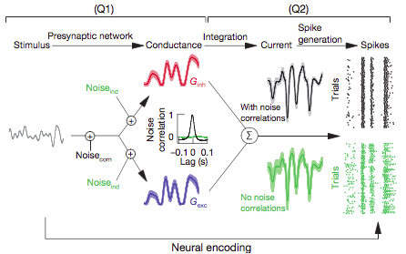
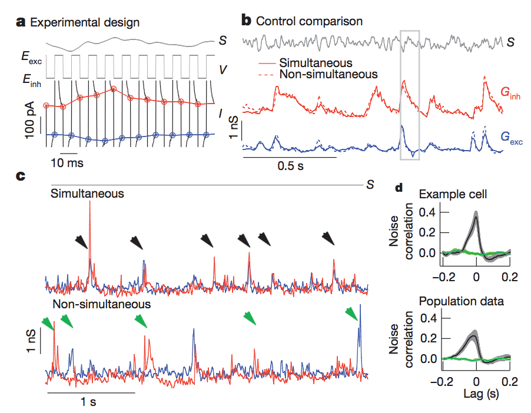
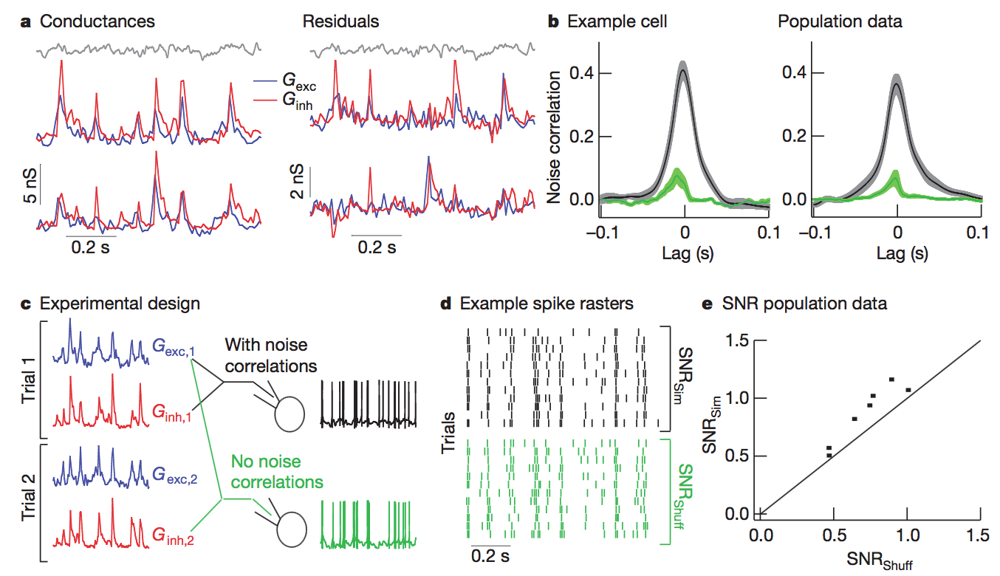
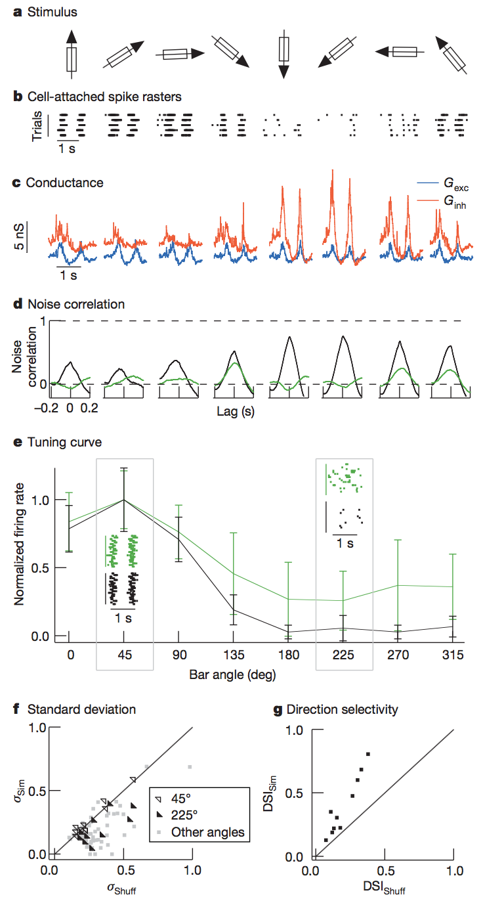

# Noise correlations improve response fidelity and stimulus encoding

* **Authors:** Jon Cafaro, Fred Rieke
* **Journal:** Nature
* **Date:** December 2010

## Big Idea

This paper set out to answer to major questions: 
1. How do excitatory and inhibitory synaptic inputs covary?
2. How do the resulting noise correlations affect neural output? 

The authors explored these questions in the retina, including midget cells and retinal ganglion cells. 

They found excitatory and inhibitory inputs typically covary (implying that positive noise correlations are present in the retina) and furthermore that the resulting neural code is stronger when noise correlations are present (implying that, perhaps, the brain should not be worried about decorrelating). 

In the grand scheme of things, this paper provides further evidence that noise correlations have helpful coding properties and provides hints that stimulus dependence may have an important impact on these coding properties. 

## Background
* Excitatory and inhibitory synaptic inputs to a cell can help cancel out noise, particularly if the noise is correlated. These noise correlations arise from shared input noise. 
 <b>Figure 1</b>

* Here, Cafaro and Rieke explored the retina because it's easy to examine the impacts of a physiologically relevant stimulus to the neural code (and thus the impact noise correlations might have on the latter). 
* Two main questions: (1) how do excitatory and inhibitory synaptic inputs covary (in a retinal ganglion cell)? (2) how do noise correlations affect the encoding of the stimulus (in this case, light)?

## Experiments

### Simultaneous/Non-simultaneous Recordings

* Their main challenge was to quantify the covariation of the excitatory and inhibitory inputs, but they had to make these measurements *simultaneously*. Otherwise, the results would be meaningless. To do this, they took some retinal ganglion cells and rapidly alternated the potential of the cells between the reversal potentials of the excitatory/inhibitory inputs. So, when the potential was set to the reversal potential of a given input, they took a sample of the current - and this was their recording for the excitatory/inhibitory input. Since they were alternating quickly, this counted as (near) simultaneous input. This is shown in **Figure 2a** below. 
 <b>Figure 2</b>

* To make sure everything was okay with their setup, they also did non-simultaneous recordings at the reversal potentials. Averaging over repeated presentations of the stimulus, they found that the simultaneous and non-simultaneous conductances agree pretty well (**Figure 2b**). They argue that the simultaneous conductance measurements capture most of the structure in the synaptic inputs of the ganglion cell. 

* They also looked at spotaneous activity, and found that the simultaneous measurements show much more correlated activity (**Figure 2c**). The cross-correlation corroborate this for both the spontaneous and stimulated activity (**Figure 2d**). 

### Midget Cells 
* Next, they looked at midget cells. Midget cells receive what's called delayed feedforward inhibition - they receive excitatory input directly from bipolar cells, and inhibitory input from amacrine cells, which themselves receive input from the bipolar cells. So the midget cells' inhibitory input is slightly delayed because it has to go through the extra step of the amacrine cels. 
* Once again, they looked at the cross-correlation between the excitatory and inhibitory synaptic inputs for both simultaneous and non-simulataneous recordings in the midget cells. They find that cross-correlation is much more pronounced for the simultaneous recordings than non-simultaneous. They further claim that the small cross-correlation in the non-simultaneous recordings results from slow drift in the light response. 
 <b>Figure 3</b>

* Next, they did a dynamic clamping experiment. In dynamic clamping, the conductances of the excitatory/inhibitory input are used to simulate the synaptic current which is then injected into the midget cells. Then, they observed the spiking behavior. Simultaneous recordings were easy - they just used the same inputs for each trial and recorded the spiking behavior. For non-simultaneous recordings, they used shuffled data (taking conductances from Trial 1 and Trial 2, as seen in **Figure 3c**). This destroyed any correlational structure.
* They found that the signal to noise ratio of the spike trains from the simultaneous recordings was ~1.22 times higher than the non-simultaneous recordings (see **Figure 3e**). This implies that noise correlations improve the precision of coding in the midget cells (but is it by that much?).

### Moving Bar of Light
* Retinal ganglion cells respond selectively to moving bars of light based on the angle at which they move. This behavior relies on strong inhibitory input canceling and excitatory input in the non-preferred direction. They propose that covariation of the excitatory and inhibitory input can protect against noise. For example, a larger than normal excitatory input would be correlated with the inhibitory input, protecting the RGC from misinterpreting a non-preferred direction. 
* To test this, they recorded both simultaneously and non-simultaneously the excitatory and inhibitory conductances of retinal ganglion cells in response to moving bars of light in different directions (**Figure 4c**, below). They find that the simultaneous recordings show larger noise correlations (larger cross-correlation) than the non-simultaneous recordings (though, this depends on the direction - some non-simultaneous cross-correlations were decently large). 
 <b>Figure 4</b>

* Repeating the same dynamic clamp experiments, they observed the resulting firing rates from the RGCs when passed the corresponding currents given shuffled and non-shuffled conductances. In the non-simultaneous case, the resulting tuning curve was less accurate (larger stdev) and larger for non-preferred directions (see **Figure 4e**) as compared to the case with noise correlations. This implies a weaker neural code in the non-simultaneous case. 
* This is supported by **Figure 4f** and **Figure 4g** above. The former shows that non-preferred directions have larger standard deviations for shuffled data, while the latter shows that the direction selectivity is better in the simultaneous case. Direction selectivity is a measure of how well tuned then neurons are to the various directions the bar can take. 