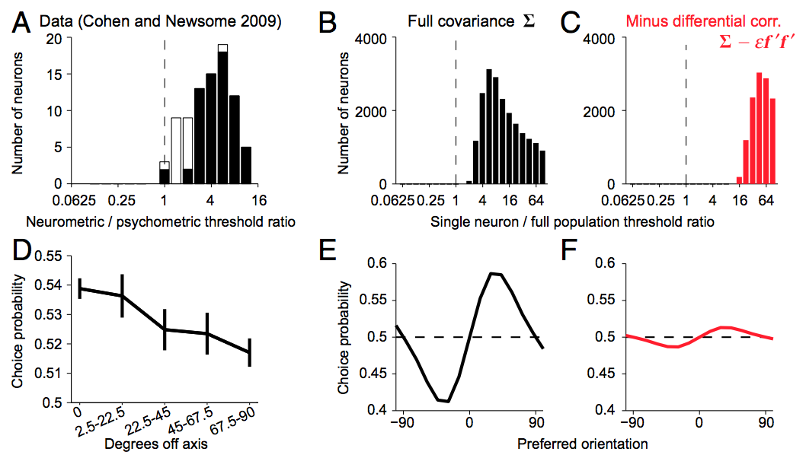

# Origin of information-limiting noise correlations

* **Authors:** Ingmar Kanitscheider, Ruben Coen-Cagli, Alexandre Pouget
* **Journal:** PNAS
* **Date:** November 2015

## Introduction
* Correlated trial-to-trial variability is have been observed in cortical neurons and are important because they can have a profoud impact on behavioral performance. A particular structure of noise correlations, called differential correlations, result in network information saturating as a function of the number of neurons. 
* What is the source of noise correlations, and particularly, differential correlations?
* Possible sources of noise correlations include (1) shared connectivity, (2) feedback signals, (3) internal dynamics, and (4) global fluctuations in the excitability of cortical circuits. Correlations induced by global fluctuations, however, do not limit information in most discrimination tasks. 
* In this paper, they find that feedforward processing induces correlations that share many of the properties of correlations observed in vivo. Furthermore, feedforward processing leads to information-limiting correlations. 

## Information-Limiting Noise Correlations Induced by Computation
* The goal of their network is to determine the orientation $\theta$ of the visual input, which is a Gabor function. Their model for LGN/retina is to corrupt this image by Gaussian white noise. Then, they model V1 neurons as linear-nonlinear Poisson inputs. The linear filter for each neuron is a Gabor receptive field (with tuning $\theta_i$). The nonlinearity for each neuron is a rectifying nonlinearity. 
 <b>Figure 1</b>

* Their model reproduces heterogeneous tuning as a function of $\theta$ (1B, above). Furthermore, they demonstrate that correlations between the V1 neurons fall off as the difference in their preferred orientation $\theta_i$ become different (1C, above). Lastly, they show that differential correlations are induced in their network because the Fisher information saturates as a function of the number of neurons (1D, above). Their saturating Fisher information indicates that they can discriminate up to 2 degrees of orientation. 
* Their correlation coefficients, on average, are larger than those typically found in cortex (~0.1). They explain this as due to the fact that their receptive fields are overlapping in space and spatial frequency (and thus have similar tuning, inflating their correlations). 
* When they instead have hetergeneous filters with properties drawn from typical V1 populations, they find that the correlation coefficients match better with data (their estimate is ~0.09 for the mean). They also find that the Fisher information still saturates and furthermore performs more poorly (2B, below).
 <b>Figure 2</b>

## Network Optimization Cannot Increase Information Indefinitely
* In this section, the consider the "optimal" network for coding the stimulus. In previous studies, optimizing the network was easy - you just messed with the tuning curves or correlational structure. It's not so easy to do that in their feedforward model, because the tuning and correlations are tied closely to each other. Instead, they have to modify the connectivity.
* The optimal network, in this case, recovers all of the input Fisher information $\text{FI}_{\text{input}}$. They show that the Fisher information of the responses is given by $$\text{FI}_{\text{neural}} = \text{FI}_{\text{input}}\cos^2\alpha$$ whee $\alpha$ is the angle between the derivative $\mathbf{I}'(s)$ and the vector space spanned by the filters (not entirely sure what they mean by this). 
* Thus, if $\mathbf{I}'(s)$ can be written as a linear combination of the filters, then they've achieved optimal connectivity. 
* Their network optimization does not imply sharpening or decorrelation. Their optimal network has filters that are matched to the stimulus (this seems obvious...?). In 3A below, they show that optimal tuning curves are not sharper than suboptimal tuning curves (would be nice to quantify this further). Furthermore, suboptimal tuning curves exhibit weaker long-range correlations but stronger short-range correlations (3B). Lastly, their optimal correlations saturate sooner than the suboptimal correlations. 
 <b>Figure 3</b>

## A Quadratic Nonlinearity Yields Contrast-Independent Correlations and Decoding
* Instead of a rectifying nonlinearity, they tried a rectified quadratic function because it matches better with results in vivo. They found that using a rectified quadratic results in correlations that decline with dissimilar tuning and limited information.
* Differences arise when considering the contrast of images. Specifically, the quadratic nonlinearity does not result in variation of correlation coefficient as a function of contrast (Figure 4A, below). Furthermore, the decoding weight does not change as a function of contrast. In 4B, below, we see that contrast changes the decoder for the linear rectifier while the quadratic rectifier is relatively constant. Thus, as contrast fluctuates trial-to-trial, the optimal decoder does not need to be adapted.
 <b>Figure 4</b>

* Furthermore, they find that both the linear and quadratic rectifiers are susceptible to the level of sensory noise. Increasing the amount of sensory noise in general decreases many of the normalized weights, as the weights for the neurons that are most similar to the input become the most important (4C). 
* This implies that if an animal is trained on a task with noise, it will not be robust to changes in noise of that task (because the decoder has changed). Lu and Dosher have provided supporting evidence for this claim. 

## Global Fluctuations Reduce, but Do Not Limit, Information
* Next, they asked how global fluctuations affected feedforward-generated noise correlations and what impact they have on information. Their model for global fluctuations follows Goris et al., in which they use a fluctuating gain factor along with an underlying stimulus-driven rate. Thus, the global fluctuations increase the noise correlations in all directions and add a rank 1 perturbation (5A, below). 
 <b>Figure 5</b>

* They show that global fluctuations cause an increase in noise correlations in 5B (homogeneous tuning) and 5C (heterogeneous tuning) above. Notice that the input noise and internal fluctuations, together (blue) has on the whole larger correlations than input noise along (black). Furthermore, internal fluctuations alone (cyan) have correlations that weakly depend on tuning similarity. Heterogeneous correlations are on the whole weaker than the homogeneous case.
* Internal fluctuations alone do not cause Fisher information to saturate (5D, 5E) and thus do not possess differential correlations. If they are coupled with input noise, however, they cause Fisher information to saturate at a point below that of input noise alone. This is because internal fluctuations stretch the noise correlations uniformly in all directions - including the differential correlations. Larger differential correlations means decreased Fisher information. Further note that heterogeneous tuning (5E) results in a population that saturates later than homogeneous tuning (5D). 
* One last point: global fluctuations reduce aymptotic information only if the decoder does not have access to the fluctuating gain factor. Otherwise, we could just divide out the gain factor and be on our way decoding as normal. 
* Relating this internal fluctuation to internal states: Ecker and Goris conjectured it could reflect arousal, attention, or adaptation. Furthermore, attention could be seen as a mechanism that improves behavioral performance by reducing the variance of global fluctuations. 

## Computation-Induced Noise Correlations Contain a Tiny Amount of Differential Correlations
* Their model seems to be in contradiction with the Ecker et al. model in which diverse tuning prevents information saturation. They claim, however, that their model possesses differential correlations while Ecker's does not, which is why information saturates in this case. 
 <b>Figure 6</b>

* Above, they consider a heterogeneously tuned population (6A) and they consider the correlations coefficient with and without differential correlations (6B). Differential correlations have a small impact on the distribution of correlations, but their structure forces the Fisher information to saturate (6C). 
* Thus, detecting differential correlations in data is very difficult to do. 

## Paradoxes of Cortical Models That Do No Operate at Saturation
* Clearly, the brain receives limited input information and so information will saturate. But is the brain in the regime where adding more neurons will increase information, or is the brain at saturation point? The behavioral threshold can be explained by a population of neurons with differential correlations of ~0.12, whereas an independent population will increase without bound. This is shown in Figure 7, below. 
 <b>Figure 7</b>

* They discuss the observations in the literature that neurometric thresholds for single neurons, that is, the minimal stimulus difference that could be detected by an ideal observer of a single neuron) are comparable to the psychometric threshold, which is the threshold given by perceptual tasks. When they same comparable, they mean that the neurometric threshold is at least as large, if not up to 16 times larger (which to me doesn't really seem "comparable" anymore). This is shown in 8A, below. 
 <b>Figure 8</b>

* Next, they observe that in a population of unsaturating information, the neurometric threshold will be way smaller than the psychometric threshold, because the population will contain a lot more information (information is no longer saturating). Thus, the neuro/psycho threshold will be larger, as shown in red in 8C. If we take the full covariance matrix, with the differential correlations (8B), we find something more comparable to 8A.
* Next, they look at choice probability (CP) which is the correlation between single neuron activity and perceptual choice on a trial-to-trial basis. In 8D, they plot the choice probability as a function of difference between the neuron's preferred stimulus and the discrimination axis. If we've got a CP of 0.5, there's no correlation between the single neuron's activity and the behavior. As we might expect, as the difference between preferred stimulus and discrimination axis increase, the choice probability becomes close to 0.5. Interestingly, we start at ~0.54, which seems to indicate that single neurons alone are not that good at correlating with the perceptual task. 
* In a fine discrimination task for orientation, the choice probability varies with the preferred orientation (in this case, the stimulus was at orientation 0 degree, I believe). When differential correlations are removed, the single neuron contributes a lot less to choice probability (8F). Overall this seems like strange behavior and I'm not entirely sure what they're arguing.

## Discussion 
* They reiterate that their study supports the idea that differential correlations can only arise from shared input noise or suboptimal computations. Furthermore, detecting differential correlations requires measuring from thousands of neurons simultaneously. 
* In this case, they were able to use Fisher information because their high-dimensional stimulus was parameterized by some scalar. An interesting extension would be to consider a high-dimensional input that depends on a scalar stimulus and fluctuating nuisance variable $t$. 
* Overall, this study seems like an extension of the Moreno-Bote et al. paper on differential correlations. Their study offers support for their original claims as to the source of differential correlations in light of other suggestions for the sources of noise correlations. 