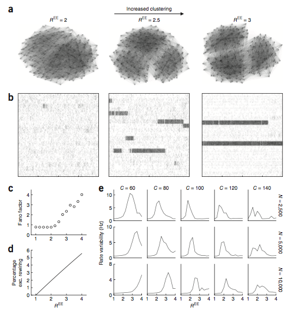

# Slow dynamics and high variability in balanced cortical networks with clustered connections
* **Authors:** Ashok Litwin-Kumar, Brent Doiron
* **Journal:** Nature Neuroscience
* **Date:** November 2012

## Introduction
* Cortical neurons produce spike trains with a high degree of variability, but also exhibit firing rate fluctuations over long timescales. These factors in combination manifest themselves as large trial-to-trial variability. Much of this has been attributed to the balance between excitation and inhibition. 
* The goal of this paper was to understand how network architecture influences the stochastic dynamics of these networks. Specifically, they examined network architecture which exhibited clustered subnetworks.
* Broadly, they showed that just rewiring a few percent of neurons into clustered subnetworks could have a dramatic impact on the network's firing patterns. 

## Figure 1
* They examined a network with uniform connectivity and clustered connectivity. Their network consisted of 4000 excitatory neurons (E) and 1000 inhibitory neurons (I).  The neurons were modeled as leaky integrate-and-fire units with synapses modeled as differences of exponentials. 
  <b>Figure 1</b>

* **Figure 1A, 1B (left)** show a schematic and example graph of the uniform network. In the uniform network, th connections were all with probability 0.5, except EE connections, which were with probability 0.2. Meanwhile, on the right, we see the clustered network schematic and graph. In the clustered network, 50 clusters of 80 excitatory neurons were chosen. A constant, $R^{EE}$, dictated the strength of in-network connections compared to out-network connections. Thus, a larger $R^{EE}$ implies that the connectivity within clusters, on average, is stronger. These probabilities were chosen, however, to maintain a total probability of 0.2 for EE connections. 
* The uniform network exhibits asynchronous activity both in time (**Figure 1C, left**) and across neurons (**Figure 1D, left**). Meanwhile, the clustered network exhibits dynamic transitions between on and off states (**Figure 1C, right**), with these transitions occurring within groups of neurons (**Figure 1D, right**). 

## Figure 2
They examined spiking statistics in the uniform and clustered networks.
* First, they computed the firing rate distribution of the excitatory neurons in both network types. I believe this distribution encompasses 12 realizations of each network type, with 9 trials for each realization. In **Figure 2A**, we don't really see much of a difference between the firing rate distribution of the unfirom and clustered neurons. They're both skewed distributions, with the clustered having a slightly larger firing rate. 
 <b>Figure 2</b>

* **Figure 2B** shows the distribution of Fano factors (here, the Fano factor is the ratio of the variance across trials to the mean over trials in 100 ms windows). There is a noticeable difference between uniform and clustered: uniform networks exhibit sub-Poisson variability (around 0.78, on average), while the clustered network has supra-Poisson variability. This additional variability is due to the transitions in active states.
* Next, they examined spike count correlations between pairs of neurons. The distribution of these correlations is shown in **Figure 2C**, which shows a distribution centered roughly around 0 for both networks. This is pretty typical for balanced networks, which exhibit decorrelation among their neurons. 
* If you examine the correlations among just neurons that are clustered, however, as **Figure 2D** shows, you see a much different scenario: there is a clear nonzero average correlation here, which can be attributed to the fact that clusters typically turn on and off together. 
* **Figures 1E, 1F** show the autocovariance and cross-covariance, respectively, of neurons in these networks. The takeaway: there's no interesting structure in either quantity for neurons in the uniform network. Neurons in the clustered network (importantly, **Figure 1F** only shows cross-covariances for neurons in the same cluster) exhibit longer timescales for both functions. This indicates a greater degree of structure in the temporal firing, both alone and in pairs, of neurons in the clustered network. 
* Lastly, they examined the behavior of the Fano factor (discussed above) as a function of the time window used to calculate the quantity (in **Figure 1B**, it's 100 ms). The Fano factor increased for clustered networks as a function of time, while it saturated for uniform networks. For "imbalanced" networks, which did not obey a balance between inhibition and excitation, the Fano factor dropped.

## Figure 3
Cortical assemblies exhibit large degrees of heterogeneity in size and overlap. Here, they examined the effect of heterogeneity on the firing patterns of the neurons in the network.
* **Figure 3A** shows a schematic for the clustering of their heterogeneous network. Here, each neuron was assigned to two clusters out of 100 total. Connection probability and strength were increased for neurons that shared membership in at least one cluster.
 <b>Figure 3</b>

* This implies that the cluster size in a network will be heterogeneous, as shown by **Figure 3B**. 
* An unordered raster of an example trial in the heterogeneous network is shown in **Figure 3C**. When the rows in the raster were sorted by cluster, however, clear transitions become apparent as shown in **Figure 3D**. 
* The heterogeneous network exhibits more complicated firing patterns than simple on/off transitions. This is shown in a plot of average firing rates for different clusters in **Figure 3E**. The homogeneous network generally only shows on-off transitions. The heterogeneous network shows on-off transitions with more complicated dynamics overlayed. 

## Figure 4
* Recall that the constant $R^{EE}$ sets the amount of clustering that occurs in the network. They examined how this level of clustering impacts the timescale of the sustained activity. **Figure 4A** below shows different networks with increasing amount of clustering. 
 <b>Figure 4</b>

*  As clustering increased, the timescale for the high activity states increased as shown by **Figure 4B**. They also show that the Fano factor over 100 ms windows increased for increased clustering (**Figure 4C**). I think a larger Fano factor implies more sustained firing for the high activity states, but I'm not sure. Next, **Figure 4D** shows what percentage of rewiring is required from a uniform network to a clustered network at a given $R^{EE}$. Their only point here is that it's always small in the regime they considered - max of about 5%. 
*  Interestingly, the Fano factor only begins increasing above a certain $R^{EE}$ in **Figure 4C** - around 2.5. So, they examined this "phase transition" for different network sizes $N$ and cluster sizes $C$ in **Figure 4E**. 
*  **Figure 4E** plots the "firing rate variability," which I assume is some sort of standard deviation. They say they computed the population firing rate of the neurons in a given cluster over 2s in windows of 100ms each, and averaged this over clusters and realizations of the network. At any rate, we see that the variability peaks for a given $R^{EE}$ and then drops beyond this. They claim this is due to the high-activity timescale being longer than simulation time. 
*  Other observations: as $N$ increases, the peak shifts to the right. They claim that this is due to the fact that synaptic strength is inversely proportional to network size in balanced networks. Thus, you need more clustering to get to higher activity states. Furthermore, with increased $C$, the peak shifts to the left and decreases in size. Larger $C$ implies that there are less neurons per cluster, which means you don't need to be as strongly clustered to see high activity states.

## Figure 5
Their hypothesis is that the network architecture has a strong impact on the firing patterns of neurons. With this in mind, they constructed a simple network which was easy to analyze theoretically. In this network, the neurons were either active or inactive (binary), and the input to a neuron was a weighted sum of the activities of the neurons it receives input from. Lastly, there was only one cluster. One main result from their theoretical analysis is that the number of local cluster inputs only has to scale as the square root of the number of neurons. Extending their results, they considered the average firing rate of neurons in the cluster, and determined a potential energy landscape $U$ that defined this quantity.
* The potential energy landscape achieves pronoucned bistability as the clustering strength increases, as shown in **Figure 5A**. Thus, there are two modes for the cluster: active or inactive, and fluctuations in the network activity can bring the cluster from one mode to the other. 
 <b>Figure 5</b>

* When the well is deeper, as shown in **Figure 5B (top)**, there is more time spent in the high activity state. The histogram in the bottom shows the counts of average cluster activity, and it is more strongly weighted toward high activity. 
* **Figure 5C** shows the temporal variability in these high activity states: the cluster turns on and off as it jumps from one well to the other in the potential energy landscape. The authors stress that this is not the only variability: network dynamics also induce fluctuations around the activity state, as shown in the bottom of **Figure 5C**. Here, they show histograms of the input currents for neurons in the network. There is a large overlap between the low and high activity states.
* Lastly, they predicted that the transition time between activity states scales as the exponential of the potential energy difference $\Delta U$. **Figure 5D** demonstrates the veracity of their hypothesis, showing the linear relationship between the log of transition time and $\Delta U$. 

## Figure 6
* Until now, they have largely been considering spontaneous activity. Now, they consider evoked activity. Specifically, they apply a stimulus (I think by adding baseline activity).  Adding a negative stimulus has the same impact as decreasing the number of clusters, while the opposite is true for adding a positive stimulus (**Figure 6A**). 
 <b>Figure 6</b>

* Thus, the evoked activity is the result of biasing the potential energy landscape toward one well or the other - while spontaneous activity exhibits a larger degree of symmetry between the wells, as shown in **Figure 6B**. This result hints at the next section, in which they reference the decrease in variability of evoked activity.

## Figure 7
* They examined the effect that stimulation had on their more complex networks by depolarizing 5 of the 50 clusters for 400 ms. When the stimulation occurred, the stimulated clusters became highly active while the unstimulated clusters became suppressed (**Figure 7A**). This manifested itself as a drop in the mean-matched Fano factor which was not seen in uniform networks (**Figure 7B**). 
 <b>Figure 7</b>

* **Figure 7D** shows that this drop in Fano factor occurred for both stimulated and unstimulated clusters, implying a widespread feature in the network activity. This is in agreement with the observation that cortical activity suppresses neural activity. 

## Figure 8
Until now, they only really been looking at excitatory neurons. But it's worth looking at the inhibitory neurons, as it's been observed that they also exhibit a drop in Fano factor (but not necessarily mean-matched). Thus, they examined a network which had excitatory-inhibitory connection specificity.
* In their network, inhibitory neurons were more likely to receive input from excitatory neurons in a particular cluster, as shown in the schematic of **Figure 8A**. 
 <b>Figure 8</b>

* While both ordinary clustered and the excitatory+inhibitory clustered networks exhibited a drop in Fano factor for the excitatory neurons (**Figure 8B**), the E+I clustered network had an increase in variability followed by a substantial drop after stimulus presentation for inhibitory neurons (**Figure 8C**). The ordinary clustered network did not demonstrate this phenomenon.

## Discussion
* **Anatomical realism and attractor dynamics:** The network architectures studied in this paper are biologically inspired in their connectivity and the ensuing activity are reminiscient of persistent state activity in attractor networks. 
* **Robustness and dependence of cluster size:** Their results are consistent with the observation that clusters are on the order of tens, rather than thousands, of neurons. Furthermore, their model exhibits sharp transitions between attractor states with large differences in firing rate. 
* **Models of cortical variability and co-variability:** While their balanced network shows an overall distribution of correlations centered around 0, specific clusters of neurons exhibit non-zero correlations on average. While their model captures simple spiking statistics, they note that their model fails to capture prominent, low-frequency correlation membrane potential fluctuations that has been observed in rat somatosensory cortex. 
* **Relationship between spontaneous and evoked activity:** Their results corroborate the observation that stimulus presentation quenches variability in spontaneous to evoked acitivty; furthermore, they also imply that the evoked sensory stimulation activity is a subset of the spontaneous activity.