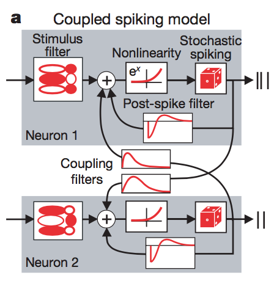
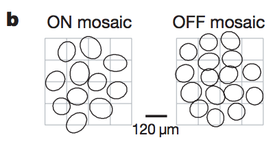
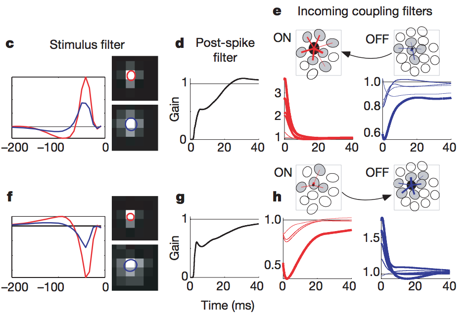
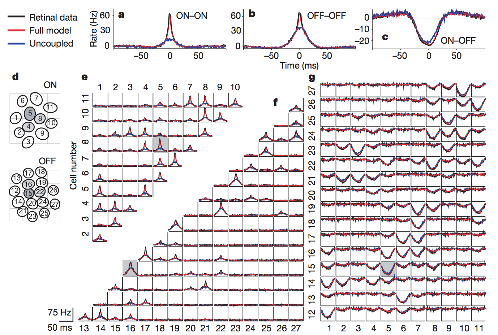
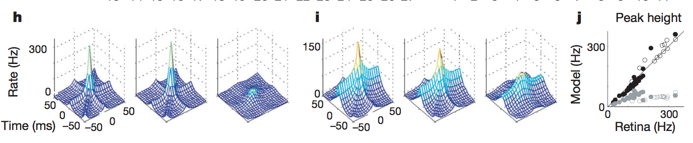
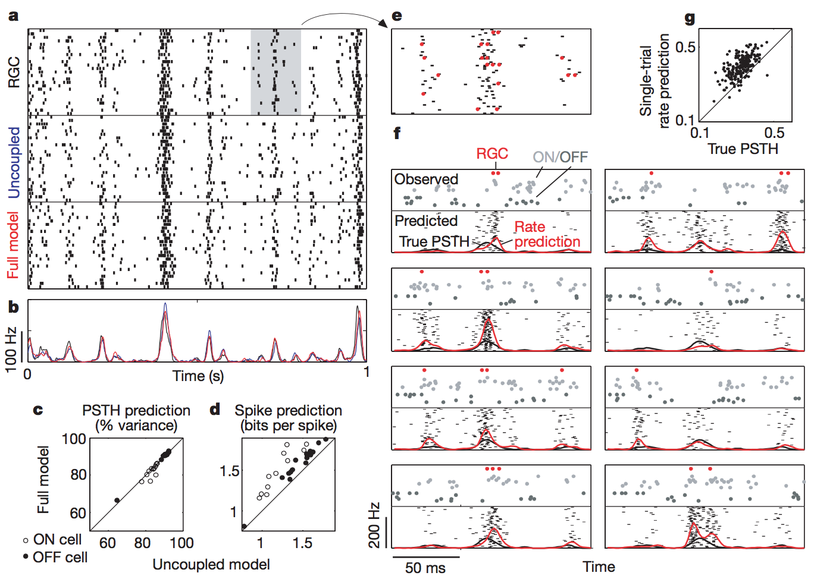
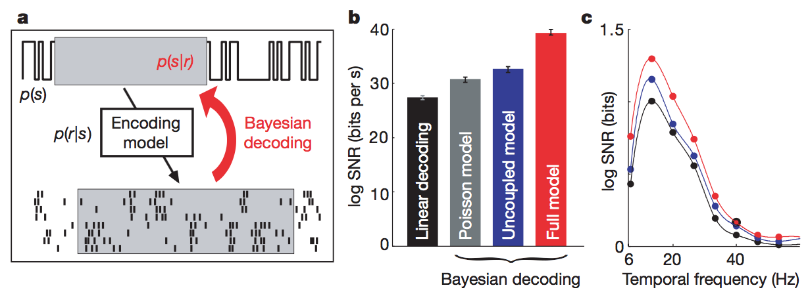

# Spatio-temporal correlations and visual signalling in a complete neuronal population
* **Authors:** Jonathan W. Pillow, Jonathon Shlens, Liam Paninski, Alexander Sher, Alan M. Litke, E.J. Chichilnisky, Eero P. Simoncelli
* **Journal:** Nature Letters
* **Date:** August 2008

## Introduction 
* The spiking activity of neurons in the early visual system must be able to represent the sensory environment in some fashion. To discern the specific coding procedures utilized by populations of neurons, we must surely understand the neuronal correlations, or the tendency of neurons to fire temporally coordinated spiking patterns. 
* This study utilizes a phenomelogical, model-based approach to better understand the spiking patterns in a complete neuronal pattern. Thus, the study makes no effort to explain the spiking patterns from a first-principles or mechanistic perspective. Instead, they fit a model, whose components have biophysical analogues, to gain insight on the nature of the correlated activity of the neurons. 

## Model 
### Definition
* Let's go over the authors' model, which is an important model that has motivated many later studies. The skeleton for their model is the *generalized linear model* (GLM). For each neuron, they try and predict the number of spikes in specific time bins. To do so, they perform the linear part of the GLM, in which they linearly combine the following factors:
    * <b>Stimulus:</b> The application of a spatio-temporal receptive field to the stimulus;
    * <b>Coupling:</b> The application of filters to the activities of all other neurons;
    * <b>Post-spike filter:</b> The application of a filter to the previous spiking behavior of the current neuron.
* Once these factors are linearly combined (shown below), that result is passed through an exponential nonlinearity. The exponential is a good nonlinearity because (1) it acts as a soft threshold and (2) is equivalent to multiplying the exponentials of each individual factor, which allows us to compare contributions between the factors more easily. 
 <b>Figure 1a</b>

* Lastly, the result of the nonlinearity acts as a time-dependent mean, which is passed through a Poisson distribution to provide us with the number of spikes in a given time bin. 
* They claim the following biophysical motivations for the components of their model:
    * The stimulus filter acts as the spatio-temporal integration of light.
    * The post-spike filtering mimics voltage-activated currents following a spike.
    * The coupling filters resemble synaptic or electrical interactions between cells. 

### Data
* They fit their model to data recorded *in vitro* from a population of 27 ON and OFF parasol ganglion cells that were taken from macaque monkey retina. The cells were stimulated with 120-Hz spatio-temporal binary white noise. **Figure 1b**, below, shows the tiling pattern of the parasol cells' receptive fields. They claim that one strength to their study is that the receptive fields tile the entire region of that part of visual space, indicating that they a complete population of cells. 
 <b>Figure 1b</b>

### Fitted Parameters
* They fit their model with maximum likelihood (with a regularizing penalty on the coupling filters). **Figure 1c-1h** below shows the fits for an example ON cell (top row) and OFF cell (bottom row). We'll go through these one by one. 
 <b>Figure 1c-1h</b>

    * First, the stimulus filters. They show this in **Figure 1c**  for an ON cell and **Figure 1f** for an OFF cell. The spatial part of the stimulus filter is shown on the right: there's the center part, dictated by the red, and the surround which is determined by the blue. The total spatial filter is given by the difference between red and blue. So, for the given ON cell, they expect to see a white patch in the middle, surrounded by a dark ring (remember, it's red minus blue), and it doesn't care what happens beyond that. The temporal part of the filter is shown in the plot on the left, which provides the magnitude of the spatial part as a function of time. All this says is that the stimulus filter is only sensitive for the past 50 ms or so. Notice that the signs are flipped for the OFF cell.
    * Second, the post-spike filter. What they show is the gain (so the result after exponentiation). Their plots depict a recovery from the refactory period: after a spike at time zero, the gain is less than 1 for about 40 ms, after which the gain returns to normal (or slightly overshoots). 
    * Lastly, the coupling filters. The ON cell, on the top, is strongly coupled to nearby ON cells. Meanwhile, there's much weaker coupling with nearby OFF cells, implying that if nearby OFF cells fire, there will be a reduction in the total gain of the ON cell's firing. Both of these couplings are transient (lasting around 10 ms). The opposite is true the example OFF cell: weak coupling to nearby ON cells, and strong coupling to nearby OFF cells. 

## Analysis of Response Correlations
* One of their major goals in this study is to examine the correlational structure of the neurons and assess how well their model predicts that structure. The classical approach to understand correlational structure is to look at cross-correlation functions (CCFs) between paris of neurons. Below, in **Figure 2a-2c**, they show the CCFs for an example ON-ON pair, OFF-OFF pair, and ON-OFF pair. They show three CCFs for each pair: the one generated from retinal data (the "true" CCF), the one generated from their full model, and the one generated from the model which *ignores* coupling and only considers the stimulus filter and spike history filter. Some notes about what these plots tell us: 
 <b>Figure 2a-g</b>

    * The $y$-axis is firing rate above baseline. So when the ON-OFF plot goes negative, that means a spike in an OFF cell is correlated with a *drop* in spiking for the ON cell. This is behavior we would expect.
    * The data (and full model, which captures the data very well) emphasizes a sharp peak at 0, implying highly synchronous spiking.
    * The uncoupled model fails to capture the sharp peak at 0. Thus, the full model, which can only induce correlations through the similarities between stimulus filters, fails to capture the full correlational structure of the neuronal population. Therefore, an independent encoding model is not accurate, and the neurons are strongly dependent on their coupling to each other.
* These points are reinforced by **Figure 2d-g**, which show the same thing as **Figure 2a-2c**, but for all possible pairs of neurons. Whenever neurons of the same type are correlated (and in fact, not all pairs of neurons are correlated), they exhibit a sharp peak in the CCF which cannot be captured by the uncoupled model. The uncoupled model is able to capture the CCFs of the ON-OFF pairs adequately, but this is likely because these correlations can easily be inherited through the stimulus. 
* The authors also examined higher order correlations. They used "triplet CCFs" which plot the firing rate of one neuron against the spike times of two other neurons. In **Figure 2h**, they show the triplet CCF of three ON cells for the (left to right) data, full model, and uncoupled model. Notice that the full model captures the large peak at the origin (indicating synchronous spikes of all three cells) as well as ridges along the axes (indicating synchronous spikes of just two of the three cells). The uncoupled model fails to capture these effects to as strong as degree.  
 <b>Figure 2h-j</b>

* **Figure 2i** shows the triple CCF of three OFF cells for (left to right) the data, full model, and uncoupled model. We see similar effets: pairwise and triple synchronous activity captured by the full model. 
* **Figure 2j** reinforces this point: it plots the peak height at the origin of the triplet CCFs for the model against the retinal data. Thus, the identity line in this plot indicates that the model predicts the same peak as the retinal data. The black and open white circles align very nicely with the identity line: these correspond to the OFF and ON triplet CCFs, respectively. The gray colored and open circle (OFF and ON, respectively) are well below identity line (indicating underestimation of the peak in the data), and they correspond to the uncoupled model. 

## Spike-train Prediction Comparison
* The authors have just shown that an uncoupled model fails to capture accurate second- and third- order correlations. However, the uncoupled model performs just as well at capturing *average* responses for *single* neurons. They show this by presenting their models with the same test data for 25 trials. The results of the single trials are shown in **Figure 3a** below, while the predicted PSTHs over the 25 trials are shown in **Figure 3b**. Both the uncoupled and full model explain about 84% of the variance in the PSTH of **Figure 3b**.  
 <b>Figure 3</b>

* Furthermore, over a variety of cells (both ON and OFF), the full model does no better than the uncoupled model at explaining the variance in the PSTHs. So, how does the full model do better than the uncoupled model? In the prediction of *individual* trials. The full model is better able to capture the trial-to-trial variability than the uncoupled model. When they assessed the spike prediction of each model, that is, the log-likelihood of a particular spike train given a specific model and stimulus, they find that the full model outperforms the uncoupled model (**Figure 3d**). This is because the real population possess shared variability, which may be produced by shared noise: thus, treating the neurons independently will fail to capture this variability. 
* If the PSTHs typically ignore the correlational effects induced by coupling, how can we better incporate correlations into the average response of a given cell? The authors devise a "population-conditioned" PSTH. First, they draw samples of spike trains for a given cell given the stimulus *and* spike trains of other cells. Averaging *these* responses over trials provides the population-conditioned PSTH. 
* As an example, look at **Figure 3f**: they show 8 different population conditions PSTHs. For each one, the top shows the observed data, with the cell in question shown in red (and coupled cells shown in gray). The bottom shows 25 predicted samples given the stimulus and population activity. Averaging over these 25 samples provides the population-conditioned PSTH, shown in red. The red curve, just by the eye test, tends to match the observed data better than the black curve (which is just the vanilla PSTH). 
* They confirm quantitatively that the population-conditioned PSTH is a better match to the data than the true PSTH in **Figure 3g**. Here, they plot the correlation coefficients of the true spike trains with predicted spike trains against the correlation coefficient of the true spike trains and the true PSTH. These points lie above the identity line, indicating that the population-conditioned PSTH is a better match to the data.

## Decoding Neural Spike Trains
* While they showed that coupling and therefore correlations are important for encoding neural responses, who's the say that these correlations affect the amount of sensory information conveyed by the RGC responses? To test this, the authors used Bayesian decoding on the spike trains to estimate ~150ms of the stimulus for the different models. Specifically, they estimated $$p(s|r) \propto p(s) p(r|s),$$ where they had access to both the prior (experimental parameter) and the likelihood (defined by the choice of model). 
 <b>Figure 4</b>

* **Figure 4b** shows the results of their Bayesian decoding. They compared their full model, the uncoupled model, a Poisson model (an LNP model, and thus lacks post-spike information and coupling information), and simple linear decoding. Their measure of decoding performance is the $\log$SNR, which basically compares the stimulus to the residuals predicted by the models. Thus, **Figure 4b** shows that the full model performs the best at decoding, while **Figure 4c** shows the full model's decoding strength holds at all frequencies. 

## Discussion
* While their model explains functional connectivity between the cells of this population, it says little about their biophysical relationships. For example, coupling does not necessarily imply an anatomical or even causal relationship; it only implies a statistical relationship. Furthermore, the fact that Bayesian decoding in their full model results in the highest accuracy says little about whether the brain makes use of this information. 
* However, their model accurately predicts encoding and its parameters concur with high-level features of the neural population. The authors state that the model can be used to assess which features of the visual environment are encoded with the highest and lowest fidelity, and to determine how the structure of the neural code constrains perceptual capabilities. 