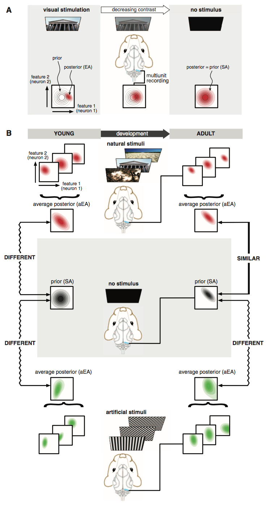

# Spontaneous Cortical Activity Reveals Hallmarks of an Optimal Internal Model of the Environment

* **Authors:** Pietro Berkes, Gergo Orbán, Máté Lengyel, József Fiser
* **Journal:** Science
* **Date:** January 2011

## Big Idea
"V1 implements an internal model that is adapted gradually during development to the statistical structure of the natural visual environment. Spontaneous activity reflects prior expectations of this internal model."
## Evoked and Spontaneous Activity and an Optimal Internal Model
* The brain must possess an internal model of the environment. Our ability to process percepts efficiently and accurately relies on how well our internal model incorporates the statistics of the environment. 
* In this study, the authors relate evoked activity (EA) and spontaneous activity (SA) to the Bayesian computations required by an optimal internal model. The model must be able to provide a probability distributions of the features in some input data, i.e. $$P(\text{features }|\text{ input}, \text{ model}).$$ This is the posterior distribution. Evoked activity corresponds to the posterior distribution, shown in **Figure 1A**, left, below. 
* If we decrease the contrast or the brightness until the image is black (in other words, no stimulus), the resulting activity is spontaneous activity. This is neural activity that occurs without a stimulus, and it should correspond to the prior distribution (because, as the contrast decreases, we must rely less on the less informative input and more on what we would expect), i.e. $$P(\text{features } | \text{ model}).$$ Thus, according to the authors, spontaneous activity should reflect what the model knows about the the statistics of the environment.  
 <b>Figure 1</b>

* This approach allows us to explore for what inputs the animal has developed an internal model. Consider **Figure 1B**, which shows how the internal model for a ferret changes throughout development. The top row shows posterior distributions in response to natural stimuli, the middle row shows the neural response to no stimulus, and the bottom row shows the posterior distribution in response to artificial stimuli (gratings). The left column is a young ferret's internal model while the right column is an adult ferret's internal model. 
* What's the takeaway? If we average the posterior distributions over the *correct* inputs, we should reproduce the prior distribution in response to no stimulus. For young ferrets, the prior distribution won't really correspond to anything, since they haven't been exposed to any stimuli. So the average posterior (aEA) for both natural and artificial stimuli will look different. But for adult ferrets, which have fine tuned their model to the natural environment, the aEA for natural images will look similar to the prior. The aEA for artificial images will still look different, though. 

## Statistical Optimality of the Internal Model
* To assess the hypothesis described in the above section, they made the recordings detailed in **Figure 1** in ferrets at four different developmental stages. Then, to measure the similarity between the aEA and prior distributions, they used the KL-divergence: $$\text{Div}\left[\left\langle P(\text{features } | \text{ input,} \text{ model})\right\rangle_{P(\text{input})} \  ||  \ P(\text{features }|\text{ model})\right].$$ Specifically, they just took the KL-divergence between the average evoked activity and the prior distribution. 
* **Figure 2A** demonstrates their approach. They recorded on 16 electrodes from awake ferret viewing natural scenen movies and darkness. Then, they divided up the recordings into 2 ms bins (vertical axis, top left). These bins were converted into 16 bit activity patterns describing whether a spike occurred at each electrode. Then, they plotted histograms of the frequency of activity patterns for the different stimuli. Finally, they compute the KL-divergence between the histograms. 
 <b>Figure 2</b>

* **Figure 2B** shows the KL-divergence as a function of postnatal age. Note that it decreases, implying convergence between the aEA and SA distributions. At a mature age, the divergence between the two is not statistically significant. 
* In **Figure 2C**, they show scatter plots detailing the frequency of each pattern in the spontaneous recordings and the movie-evoked recordings. Each dot represents a unique activity pattern and its color indicates how many spikes occurred (so the blue dots are activity patterns with fewer spikes). Notice that, for younger ferrets, the activity patterns appear more often in the movie-evoked activity than for the spontaneous activity (below the identity line). For mature ferrets, the activity patterns cluster around the identity line, indicating a stronger degree of similarity. Furthermore, the mature ferret has much higher overall spiking activity. The panels to the left of each plot show the neural activity across the electrodes. 

## Spatial and Temporal Correlations
* They considered whether the correlational structure of the neuronal response was important to the matching between average EA and SA. To do so, they designed "surrogate" distributions which possessed the same statistics as aEA and SA, but consisted of independent neurons. They found that the KL-divergence between the observed aEA/SA and the surrogate aEA/SA (respectively) increased with age (**Figure 3A**). This implies that, as the ferrets get older, the aEA and SA become increasingly correlated (and thus, diverges more strongly with an independent distribution). 
 <b>Figure 3</b>

* Next, they computed the KL-divergence between the aEA and spontaneous activity (red, **Figure 3B**, was shown in the previous figure as well) and the aEA and surrogate spontaneous activity (pink, **Figure 3B**). Note that the divergence between aEA and surrogate SA does not decrease with age, in contrast to aEA and observed SA. This implies that firing rates alone cannot explain the decreasing divergence between aEA and SA (in other words, correlations are important for the optimal internal model). 
* The above examples considered spatial correlations within presentations of an image. They also considered temporal correlations across image presentations. Specifically, they calculated the probability of transitioning between any two patterns (the bit patterns described above). Then, they calculated the divergences between the observed transitions and surrogate transitions (where the removed any correlational structure by hand). 
* In **Figure 3C**, they show that the divergence between the transition probabilities for the observed/surrogate aEA/SA decreases as a function of time delay, $\tau$. Thus, temporal probability transitions for the observed and surrogate data look different on short timescales, but on longer timescales, they start to look similar. Since the only difference between the observed/surrogate data is that the observed data has higher-order correlations, **Figure 3C** implies that temporal correlations decrease as a function of delay for both the aEA and SA. 
*  These data are taken from adult ferrets, presumably attuned to their environment. Since natural scenes also possess statistical structure in the temporal domain, an optimal internal environment would take this into consideration: aEA and SA should look similar temporally. In the bottom plot of **Figure 3C**, they show that the divergence between transition probabilities for the aEA and SA (red) is small for all timescales, implying that these distributions possess very similar statistical structure in the temporal domain. Meanwhile, the divergence between transition probabilities of the observed aEA and surrogate SA (pink) decreases as a function of delay. Thus, this plot tells us that ferrets have developed an internal model that takes into account temporal structure of natural images, and furthermore, correlations in the response activity of the neurons are important for processing natural input. 
*  **Figure 3D** explores similar concepts described above, but examines them as a function of age. The divergence between the transition probabilities of the observed aEA/SA (red bars) decreases as a function of age, implying that ferrets are becoming attuned to natural images. The divergence between the transition probabilities of the observed aEA and surrogate SA do not, however, decrease with age, implying that firing rates alone do not convey information about the temporal structure. 

## Specificity to Natural Scenes
* Lastly, the authors wanted to reinforce the point that the matching between aEA and SA occurred strictly for natural scenes. Thus, they performed similar recordings in ferret V1 with various stimulus ensembles, including natural movies, drifting sinusoid gratings, and dynamic binary block noise updated at a frame rate. The divergence between the aEA of these ensembles and SA is shown as a function of age in **Figure 4A** below. Notice that, in the youngest age group, there is no significant difference between the natural scene divergence (red) and artifical stimuli (blue, green). At adulthood, however, natural scene divergence is significantly smaller than the other two. Furthermore, natural scene divergence is the only one that decreases monotonically as a function of age. 
 <b>Figure 4</b>

* To reinforce this point, they project the neural activity to a two-dimensional space using a technique called multi-dimensional scaling (**Figure 4B**). All distributions are compared to the natural scene aEA, which is the origin in this space (red dot). Next, age is shown by contrast; faintest dots are younger while darker dots correspond to older ferrets. Notice that, at a young age, the SA activity is dissimilar to all aEAs; as the ferrets age, however, the SA activity moves toward the origin. 
* Lastly, they computed pairwise divergences between each of the aEAs (**Figure 4C**). In this plot, they show that these pairwise divergences do not significantly change with age. This implies that the SA becomes specifically tuned to the aEA of natural scenes. 