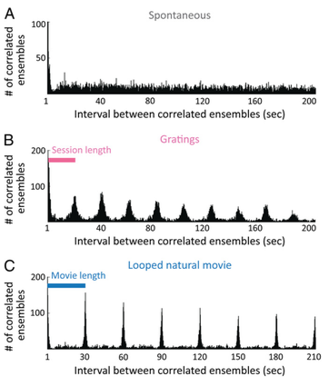

# Visual stimuli recruit intrinsically generated cortical ensembles
* **Authors:** Jae-eun Kang Miller, Inbal Ayzenshtat, Luis Carrillo-Reid, Rafael Yuste
* **Journal:** PNAS
* **Date:** September 2014

## Introduction
* The tuning model is becoming outdated: individual neurons are most likely not the building blocks of neural computation; instead, we should examine the coordinated activity of groups of neurons. There are several reasons for this: connectivity is highly recurrent and excitatory, the presence of large-scale integration of inputs, and highly structured spatiotemporal properties in the network activity patterns of V1. 
* This paper proposes that groups of coactive neurons called **ensembles** are the functional units of cortical activity. Thus, neuronal ensembles, rather than the receptive fields of individual neurons, are the building blocks of cortical microcircuits. 

### Experimental Setup
* They used two-photon imaging to "record neuronal activity simultaneously from approximately 100 neurons at a time in layer 2/3 of V1 in awake mice standing on a floating trackball." They recorded from 7 mice. <b>Figure 1A</b>, below, shows the experimental setup consisting of the mouse head-fixed and awake on the ball. **Figure 1B** shows an example of a two-photon microscopic image (the dye shows both neurons and astrocytes).  
 <b>Figure 1A,B</b>

* They considered a black screen (spontaneous activity), drifting gratings, and natural movies (for evoked activity). 
* To assess the validity of their recordings, they calculated the orientation-selective indices for the neurons; they found that ~53.9% of the neurons exhibited orientation selectivity with an average OSI of 0.45 (602 neurons over 7 mice). They claimed that these values agreed with previous studies. 

## Results 
### Defining an Ensemble
* The procedure for defining an ensemble, as far as I can tell, is as follows: 
    * First, a spike inference algorithm is applied to the calcium flourescence traces in order to obtain a spike probability; this probability is thresholded at 3 standard deviations above zero to determine whether a spike occurred or not. After this step, we have binary activity data describing each cell. 
    * Next, they define a frame, which I assume is one bin in the binary activity data across all cells. Furthermore, there's **high-activity frames**, in which a statistically significant number of cells are active. 
    * To determine statistical significance, they come up with 1000 surrogate binary activity datasets. Each surrogate dataset is formed by shuffling the interspike intervals for each cell. Now, we consider one frame across all surrogate datasets: the threshold for high activity is set at the 95th percentile of activity across the datasets.
    * If the frame in the true dataset is above this threshold, it is deemed a high-activity frame and the coactive cells in that frame form an ensemble. 
* The figure below outlines this procedure to some extent. **Figure 1C** shows the regions of interest in the field of view; **Figure 1D** shows the spike probabilities obtained by the spike inference algorithm. Specifically, the spike inference algorithm produces the probability of a spike shown in **Figure 1G**; this is done for all cells in all frames (**Figure 1H**) and the resulting frames are thresholded as shown in **Figure 1I**. This produces ensembles, like the one shown in **Figure 1E**. 
 <b>Figure 1C-1I</b>

### Ensembles Occur Spontaneously and in Response to Visual Stimuli
* First, they applied their ensemble procedure to the recordings in the absence of visual input (i.e. spontaneous activity). Then, they applied it to evoked activity in response to moving gratings and natural movies. The inferred spike rasters for 121 imaged neurons are shown in **Figure 2A** below; the spikes from cells that qualified as an ensemble are shown in red. Importantly, most of the spontaneous activity was recorded before any exposure to visual stimuli (eliminating the prospect of residual activity). 
 <b>Figure 2</b>

* How can we compare the ensembles that form across stimuli (or lack thereof)? One question we can ask is how often ensembles occur, that is, how many ensembles do we see per second. They calculate this by dividing the number of high-activity frames (thus containing an ensemble) by the total number of frames and multiplying this by the frame rate. They found (**Figure 2B**) that there was not a significant difference between the number of ensembles per second across stimuli. Furthermore, an ensemble appeared roughly every 2 seconds, which seems rather slow. 
* Next, we might ask whether there's more cells participating in ensembles across stimuli. They find no statistical difference in the percent of active cells per ensemble, as shown in **Figure 2B**. This is averaged, however; it would be interesting to see the distribution. 
* Lastly, they find the mean flourescence above baseline is significantly larger for gratings than for spontaneous activity or natural movies (**Figure 2D**). 

### Ensembles Repeat
* One immediate question is to what extent these ensembles are meaningful groups of neurons - the thresholding will inevitably pick out *some* ensembles, but there's no guarantee that these coactivations didn't just happen by chance. Thus, the authors asked whether ensembles repeat in some fashion. To assess this, they used the correlation as a similarity metric (sidenote: the correlation seems like an odd choice for similarity. Why not Hamming distance or cosine angle?). 
* To determine whether two ensembles were "significantly correlated", they once again performed a thresholding procedure with surrogate datasets. For example, consider one specific pair of ensembles with some correlation coefficient $r$. They created 50,000 surrogate datasets by randomizing the active cells in *one* frame while keeping the total number of active cells constant. In effect, they simply shuffled the active cells around (but note that this shuffling only occurred in one frame - the other was held fixed). By doing this, they obtain a distribution of correlation coefficients; if $r$ exceeded the 95th percentile of this distribution, the pair was considered significantly similar. 
* **Figure 3A** below shows three ensembles that are each significantly correlated with each other. The rest of this figure is a little more confusing. Their above method only tells whether two ensembles are significantly similar; however, groups of ensembles may all have pairwise significantly similar relationships: this is shown in **Figure 3B**. They asked: was the number of frames that participate in these "cliques" larger than we might expect by change?  
 <b>Figure 3</b>

* To answer this question, they once again cooked up 1,000 surrogate datasets, this time by shuffling spikes across cells within each frame. They kept the total activity of each cell constant as well as the total activity in a frame (shown in **Figure 3C**). With these 1,000 surrogate datasets, they calculated the number of cliques that each ensembles participated in. Their results are shown in **Figure 3D** for each mouse. The $y$-axis shows the cumulative percentage of high-activity frames participating in a clique. Thus, they all start at 100% for 2 frames in a clique, since they're only considering significantly similar ensembles. They find that the experimental data (solid lines) exhibit a greater percentage of high-activity frames participating in each clique than what you'd find on average if the spikes were occurring just by chance (within the constraints establishing by the shuffling). Thus, this implies that ensembles are repeating in the sense that significantly similar ensembles keep popping up. 
* **Figure 3E** reaffirms this point: here, they zoom into the red circle of mouse #3 (from **Figure 3C**). Here we examine more closely where the observed data falls in the distribution of surrogate data and see that it is significantly larger. 

### Responses of Individual Neurons in Isolation Do Not Account for the Occurrence of Ensembles
* Next, the authors sought to show that the firing patterns of these ensembles were more than just individual neurons firing independently. First, however, they introduce a "core ensemble." It's still unclear to me exactly what it is, but as far as I can tell, it's the cells that are in common with a clique. For example, in **Figure 4A** below, we see a 3-frame clique for each of the three types of stimuli. The cells that are in every ensemble of the clique form the core ensemble (green circles). 
 <b>Figure 4</b>

* So the authors casually changed the object of interest from ensembles to core ensembles. Perhaps at this point, they're trying to imply that core ensembles are the canonical units and other cells participate flexibly in various frames. 
* At any rate, to judge whether they can explain the behavior of these core ensembles simply by independent firing, they effectively compared the joint probability distribution of firing to the product of the individual probability distributions for each participating cell in the ensemble. If they are truly firing independently, then these should be the same. I assume they got the individual probabilities by looking at the mean firing rates (which may be an oversimplification). 
* Their results are shown in **figure 4B**. The observed frequencies of core ensembles, shown in red, are on average higher than the product of the individual firing probabilities. This implies a lack of independence between the firing patterns of the cells. In some sense, however, showing independence would have been a much more difficult task. 

### Single Neurons Participate Promiscuously in Multiple Ensembles
* The authors have detailed a procedure to find "core ensembles" within a stimulus presentation. They then asked whether neurons participate in multiple core ensembles. For example, consider the core ensembles during two different stimulus presentations in **Figure 5A** below. The neuron(s) in blue are those that are shared between these core ensembles.  
 <b>Figure 5</b>

* They compared the percentage of cells shared between core ensembles of different gratings (**Figure 5B**). For a degree difference of 45$^{\circ}$, around 8% of cells were shared; for a degree difference of 90$^{\circ}$, around 4% of cells were shared. One might hypothesize that the cells that are shared are broadly tuned. They found, however, no significant difference in the OSIs between shared cells, all cells, and unshared cells (**Figure 5B**). This implies that tuning (or lack thereof) alone cannot explain participation in multiple ensembles.
* Lastly, evoked ensembles in response to natural movies exhibited a larger fraction of shared cells. **Figure 5D** shows the percent of cells shared between different numbers of core ensembles. With just two core ensembles, ~40% of cells are shared - much larger than that of gratings. This may be simply due to the fact that natural movies have more complicated features. 

### Ensembles Evoked by Visual Stimulation Are Similar to Spontaneous Ensembles
* How similar are the spotaneous ensembles to the evoked ensembles? Are there different populations of neurons that respond spontaneously and to specific visual stimuli, or do visual stimuli recruit the spontaneous ensembles? To answer this question, the authors compared the spontaneous ensembles to the evoked ensembles using the same correlation metric described in **Figure 3**. First, when comparing pairwise relationships, they established a threshold for the correlation by generating the 50,000 surrogate datasets (**Figure 6A**). 
* To assess whether the number of ensuing correlated frames was higher than by chance, they created 100 surrogate datasets (as per **Figure 3C**) of the spontaneous data, and repeated the significant similarity analysis for each one. In each mice, they found that the percentage of frames participating in the correlated ensembles was higher than expected by chance. 
 <b>Figure 6</b>

* Thus, it seems similar ensembles are being recruited for both spontaneous and evoked activity. 

### Spontaneous Ensembles Repeat Randomly, Whereas Evoked Ensembles are Locked to Visual Stimuli
* Lastly, the authors examined whether ensembles repeated to assess whether similar ensembles were being recruited for the same stimuli. Specifically, they looked at the temporal occurrence of significantly similar ensembles. For example, **Figure 7A** shows a histogram of the interval between significantly correlated ensembles for spontaneous activity: there is no specific pattern to speak of. For gratings (**Figure 7B**) and looped natural moves (**Figure 7C**) they find consistent intervals between the correlated ensembles. The period of these intervals coincides nicely with the repetition of stimuli (~20 seconds for gratings, ~30 seconds for natural movies). 
 <b>Figure 7</b>

## Discussion

### Intrinsically Active Neuronal Ensembles
The authors argue that since ensembles cannot be explained by individual firing rates, they are indicative of more complicated fucntional connectivity (which could be derived from structural connectivity). They argue that it is not likely that this functional connectivity is derived from previous layers (e.g. thalamic input) since these ensembles have been observed in slices. While there is certainly merit to this, they hint that this connectivity could be inspired by similar tuning (in some sense) which is not supported by their observation that ensembles possess no distinct difference in OSIs. 

### Individual Neurons Contribute Flexibly to Multiple Ensembles
Their observation that neurons participate reliably in ensembles is the framework for a population coding perspective. It would be interesting to see how well their ensembles can perform at decoding.

### Visually Evoked Ensembles Are Similar to Spontaneous Ensembles
They cite a study by Kenet et al. which demonstrated that spontaneously occurring cortical states resemble the cortical responses to visual inputs. Their results corroborate this to a degree, replacing "cortical state" with "ensemble" (it's not clear if or what the distinction is). 

### Visual Stimuli Recruit Intrinsic V1 Ensembles
It's worth speculating on the fact that spontaneous and visually evoked ensembles are rather similar. The authors suggest, and I agree, that visual experience during development shapes the connectivity that would produce the spontaneous ensembles. Perhaps the cortical activity of these spontaneous ensembles is indicative of a neural circuit preparing itself to handle visual input; thalamic input will bias the spontaneous ensembles and extract the ones most useful for processing the stimulus. 

### Neuronal Ensembles as Functional Building Blocks of the Cortex
Lastly, the authors push for the idea that ensembles are the building blocks of cortex. I agree with their intent of pushing toward the idea of distributed, network-level computing in cortex. However, I am not so sure that it is as simple as ensembles. While they've shown the *existence* of ensembles, there's no guarantee that they're performing meaningful computation at face value. For example, they may be performing meaningful computation in the context of global network dynamics. In this case, it's not meaningful to speak of functional units; instead, the network state is what's important. The answer, most likely, is a little bit of both: there are probably (flexible) canonical ensembles whose computation is important in the context of global network dynamics. 